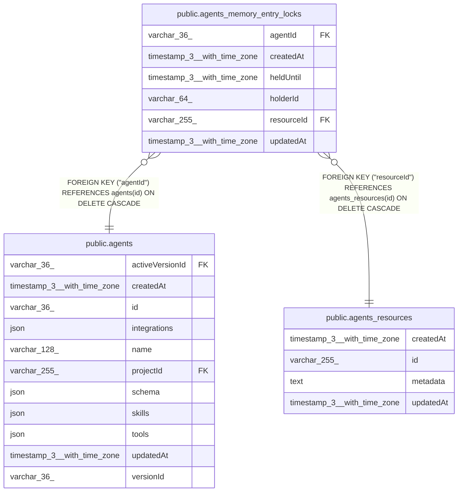

# public.agents_memory_entry_locks

## Columns

| Name | Type | Default | Nullable | Children | Parents | Comment |
| ---- | ---- | ------- | -------- | -------- | ------- | ------- |
| agentId | varchar(36) |  | false |  | [public.agents](public.agents.md) | Agent that owns this lock |
| createdAt | timestamp(3) with time zone | CURRENT_TIMESTAMP(3) | false |  |  |  |
| heldUntil | timestamp(3) with time zone |  | false |  |  |  |
| holderId | varchar(64) |  | false |  |  | Ephemeral background-task lock owner token |
| resourceId | varchar(255) |  | false |  | [public.agents_resources](public.agents_resources.md) | agents_resources.id partition locked for episodic indexing |
| updatedAt | timestamp(3) with time zone | CURRENT_TIMESTAMP(3) | false |  |  |  |

## Constraints

| Name | Type | Definition |
| ---- | ---- | ---------- |
| FK_0ccf6d9ea6f44fa1c264fc2f795 | FOREIGN KEY | FOREIGN KEY ("agentId") REFERENCES agents(id) ON DELETE CASCADE |
| FK_9594c0983cfee1c8ff49b05848b | FOREIGN KEY | FOREIGN KEY ("resourceId") REFERENCES agents_resources(id) ON DELETE CASCADE |
| PK_a8e0f570d04a174292bea104ae6 | PRIMARY KEY | PRIMARY KEY ("agentId", "resourceId") |
| agents_memory_entry_locks_agentId_not_null | n | NOT NULL "agentId" |
| agents_memory_entry_locks_createdAt_not_null | n | NOT NULL "createdAt" |
| agents_memory_entry_locks_heldUntil_not_null | n | NOT NULL "heldUntil" |
| agents_memory_entry_locks_holderId_not_null | n | NOT NULL "holderId" |
| agents_memory_entry_locks_resourceId_not_null | n | NOT NULL "resourceId" |
| agents_memory_entry_locks_updatedAt_not_null | n | NOT NULL "updatedAt" |

## Indexes

| Name | Definition |
| ---- | ---------- |
| IDX_9594c0983cfee1c8ff49b05848 | CREATE INDEX "IDX_9594c0983cfee1c8ff49b05848" ON public.agents_memory_entry_locks USING btree ("resourceId") |
| PK_a8e0f570d04a174292bea104ae6 | CREATE UNIQUE INDEX "PK_a8e0f570d04a174292bea104ae6" ON public.agents_memory_entry_locks USING btree ("agentId", "resourceId") |

## Relations

---

> Generated by [tbls](https://github.com/k1LoW/tbls)
