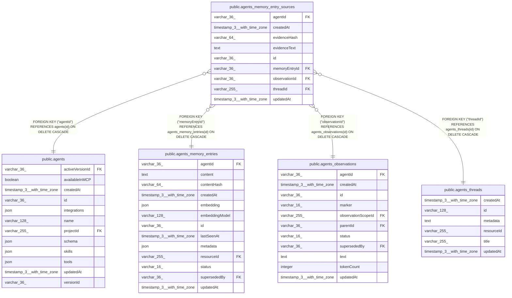

# public.agents_memory_entry_sources

## Columns

| Name | Type | Default | Nullable | Children | Parents | Comment |
| ---- | ---- | ------- | -------- | -------- | ------- | ------- |
| agentId | varchar(36) |  | false |  | [public.agents](public.agents.md) | Agent that owns the linked episodic memory entry source |
| createdAt | timestamp(3) with time zone | CURRENT_TIMESTAMP(3) | false |  |  |  |
| evidenceHash | varchar(64) |  | false |  |  | Bounded hash used to deduplicate exact evidence links |
| evidenceText | text |  | false |  |  | Exact source evidence text from the observation, not recall scope |
| id | varchar(36) |  | false |  |  |  |
| memoryEntryId | varchar(36) |  | false |  | [public.agents_memory_entries](public.agents_memory_entries.md) | Episodic memory entry linked to this source evidence |
| observationId | varchar(36) |  | false |  | [public.agents_observations](public.agents_observations.md) | Observation-log row used as source evidence |
| threadId | varchar(255) |  | false |  | [public.agents_threads](public.agents_threads.md) | Source conversation thread that produced the linked observation |
| updatedAt | timestamp(3) with time zone | CURRENT_TIMESTAMP(3) | false |  |  |  |

## Constraints

| Name | Type | Definition |
| ---- | ---- | ---------- |
| FK_451d387a182fa8dd8002dfc3a77 | FOREIGN KEY | FOREIGN KEY ("threadId") REFERENCES agents_threads(id) ON DELETE CASCADE |
| FK_4706f6223313959b7437a2b48df | FOREIGN KEY | FOREIGN KEY ("memoryEntryId") REFERENCES agents_memory_entries(id) ON DELETE CASCADE |
| FK_c38e8a57a36b880e39a52ada2e8 | FOREIGN KEY | FOREIGN KEY ("agentId") REFERENCES agents(id) ON DELETE CASCADE |
| FK_cb7c15d22fd068a0806aa57fc03 | FOREIGN KEY | FOREIGN KEY ("observationId") REFERENCES agents_observations(id) ON DELETE CASCADE |
| PK_278f05e98e74baaaa93f52b4bab | PRIMARY KEY | PRIMARY KEY (id) |
| agents_memory_entry_sources_agentId_not_null | n | NOT NULL "agentId" |
| agents_memory_entry_sources_createdAt_not_null | n | NOT NULL "createdAt" |
| agents_memory_entry_sources_evidenceHash_not_null | n | NOT NULL "evidenceHash" |
| agents_memory_entry_sources_evidenceText_not_null | n | NOT NULL "evidenceText" |
| agents_memory_entry_sources_id_not_null | n | NOT NULL id |
| agents_memory_entry_sources_memoryEntryId_not_null | n | NOT NULL "memoryEntryId" |
| agents_memory_entry_sources_observationId_not_null | n | NOT NULL "observationId" |
| agents_memory_entry_sources_threadId_not_null | n | NOT NULL "threadId" |
| agents_memory_entry_sources_updatedAt_not_null | n | NOT NULL "updatedAt" |

## Indexes

| Name | Definition |
| ---- | ---------- |
| IDX_451d387a182fa8dd8002dfc3a7 | CREATE INDEX "IDX_451d387a182fa8dd8002dfc3a7" ON public.agents_memory_entry_sources USING btree ("threadId") |
| IDX_a353ac251315ef0af6ad3c9f0a | CREATE UNIQUE INDEX "IDX_a353ac251315ef0af6ad3c9f0a" ON public.agents_memory_entry_sources USING btree ("memoryEntryId", "observationId", "evidenceHash") |
| IDX_cb7c15d22fd068a0806aa57fc0 | CREATE INDEX "IDX_cb7c15d22fd068a0806aa57fc0" ON public.agents_memory_entry_sources USING btree ("observationId") |
| IDX_f9573af4ed653f13b0ba1f7b12 | CREATE INDEX "IDX_f9573af4ed653f13b0ba1f7b12" ON public.agents_memory_entry_sources USING btree ("agentId", "threadId") |
| PK_278f05e98e74baaaa93f52b4bab | CREATE UNIQUE INDEX "PK_278f05e98e74baaaa93f52b4bab" ON public.agents_memory_entry_sources USING btree (id) |

## Relations

---

> Generated by [tbls](https://github.com/k1LoW/tbls)
