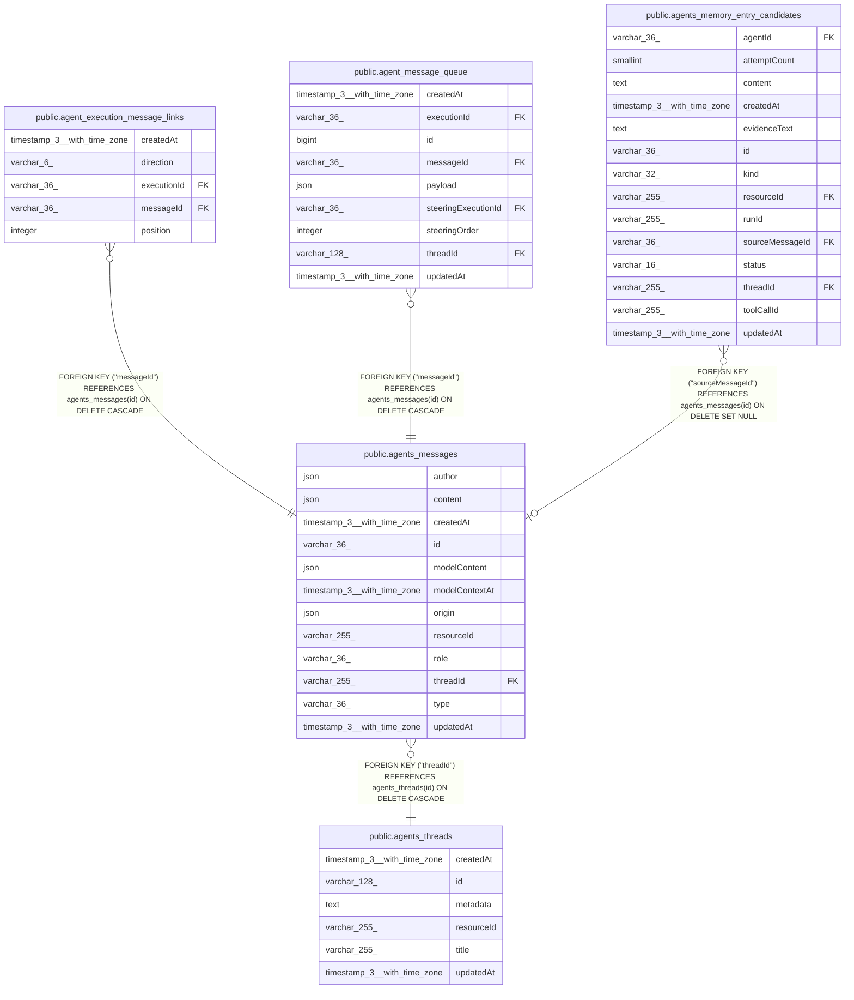

# public.agents_messages

## Columns

| Name | Type | Default | Nullable | Children | Parents | Comment |
| ---- | ---- | ------- | -------- | -------- | ------- | ------- |
| author | json |  | true |  |  | Original message author supplied by the chat platform |
| content | json |  | false |  |  |  |
| createdAt | timestamp(3) with time zone | CURRENT_TIMESTAMP(3) | false |  |  |  |
| id | varchar(36) |  | false | [public.agent_execution_message_links](public.agent_execution_message_links.md) [public.agent_message_queue](public.agent_message_queue.md) [public.agents_memory_entry_candidates](public.agents_memory_entry_candidates.md) |  |  |
| modelContent | json |  | true |  |  | Enriched model input when it differs from the original content |
| modelContextAt | timestamp(3) with time zone |  | true |  |  | Runtime ordering timestamp. NULL inputs are excluded from model context |
| origin | json |  | true |  |  | Source identifiers and transcript visibility. NULL for legacy or SDK-only messages |
| resourceId | varchar(255) |  | false |  |  |  |
| role | varchar(36) |  | false |  |  |  |
| threadId | varchar(255) |  | false |  | [public.agents_threads](public.agents_threads.md) |  |
| type | varchar(36) |  | true |  |  |  |
| updatedAt | timestamp(3) with time zone | CURRENT_TIMESTAMP(3) | false |  |  |  |

## Constraints

| Name | Type | Definition |
| ---- | ---- | ---------- |
| FK_0a8057a61afabd2999608ffd0d9 | FOREIGN KEY | FOREIGN KEY ("threadId") REFERENCES agents_threads(id) ON DELETE CASCADE |
| PK_81020dc608dfb0af1ede386d907 | PRIMARY KEY | PRIMARY KEY (id) |
| agents_messages_content_not_null | n | NOT NULL content |
| agents_messages_createdAt_not_null | n | NOT NULL "createdAt" |
| agents_messages_id_not_null | n | NOT NULL id |
| agents_messages_resourceId_not_null | n | NOT NULL "resourceId" |
| agents_messages_role_not_null | n | NOT NULL role |
| agents_messages_threadId_not_null | n | NOT NULL "threadId" |
| agents_messages_updatedAt_not_null | n | NOT NULL "updatedAt" |

## Indexes

| Name | Definition |
| ---- | ---------- |
| IDX_agents_messages_model_context | CREATE INDEX "IDX_agents_messages_model_context" ON public.agents_messages USING btree ("threadId", COALESCE("modelContextAt", "createdAt"), id) |
| IDX_agents_messages_resourceId_threadId | CREATE INDEX "IDX_agents_messages_resourceId_threadId" ON public.agents_messages USING btree ("resourceId", "threadId") |
| IDX_agents_messages_threadId_createdAt | CREATE INDEX "IDX_agents_messages_threadId_createdAt" ON public.agents_messages USING btree ("threadId", "createdAt") |
| IDX_fc7bf858660bfafd19181e8e35 | CREATE INDEX "IDX_fc7bf858660bfafd19181e8e35" ON public.agents_messages USING btree ("threadId", "createdAt") |
| PK_81020dc608dfb0af1ede386d907 | CREATE UNIQUE INDEX "PK_81020dc608dfb0af1ede386d907" ON public.agents_messages USING btree (id) |

## Relations

---

> Generated by [tbls](https://github.com/k1LoW/tbls)
