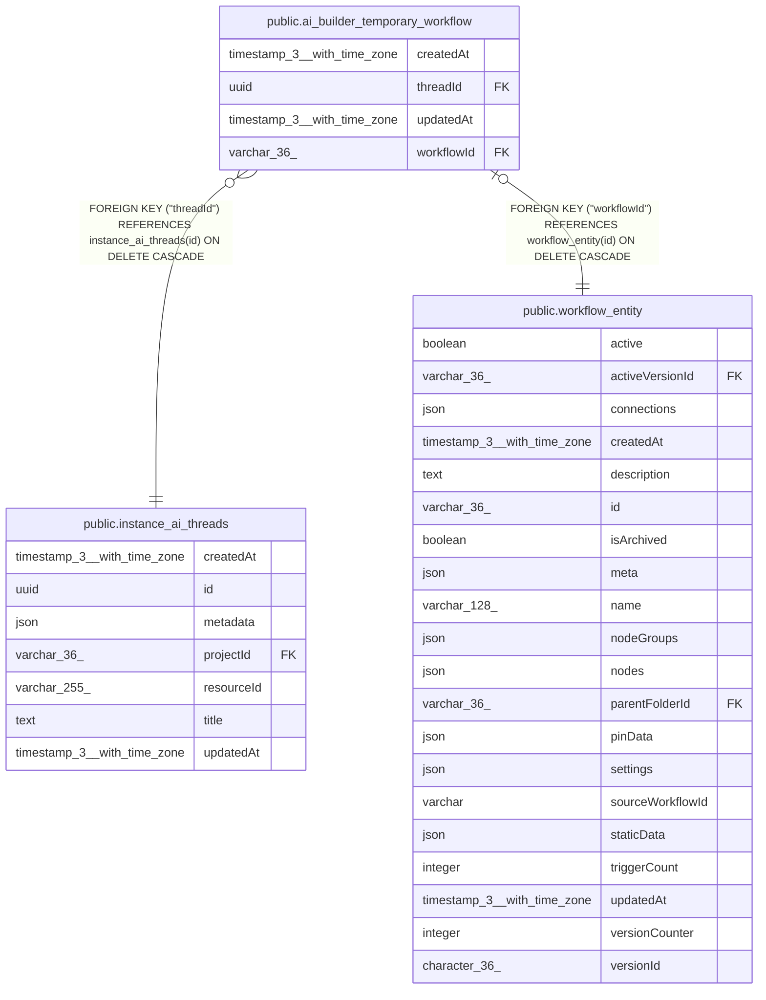

# public.ai_builder_temporary_workflow

## Columns

| Name | Type | Default | Nullable | Children | Parents | Comment |
| ---- | ---- | ------- | -------- | -------- | ------- | ------- |
| createdAt | timestamp(3) with time zone | CURRENT_TIMESTAMP(3) | false |  |  |  |
| threadId | uuid |  | false |  | [public.instance_ai_threads](public.instance_ai_threads.md) |  |
| updatedAt | timestamp(3) with time zone | CURRENT_TIMESTAMP(3) | false |  |  |  |
| workflowId | varchar(36) |  | false |  | [public.workflow_entity](public.workflow_entity.md) |  |

## Constraints

| Name | Type | Definition |
| ---- | ---- | ---------- |
| FK_39b07732e819fb561d74c38763f | FOREIGN KEY | FOREIGN KEY ("threadId") REFERENCES instance_ai_threads(id) ON DELETE CASCADE |
| FK_85a87a1ba0f61999fe11dc56325 | FOREIGN KEY | FOREIGN KEY ("workflowId") REFERENCES workflow_entity(id) ON DELETE CASCADE |
| PK_85a87a1ba0f61999fe11dc56325 | PRIMARY KEY | PRIMARY KEY ("workflowId") |
| ai_builder_temporary_workflow_createdAt_not_null | n | NOT NULL "createdAt" |
| ai_builder_temporary_workflow_threadId_not_null | n | NOT NULL "threadId" |
| ai_builder_temporary_workflow_updatedAt_not_null | n | NOT NULL "updatedAt" |
| ai_builder_temporary_workflow_workflowId_not_null | n | NOT NULL "workflowId" |

## Indexes

| Name | Definition |
| ---- | ---------- |
| IDX_39b07732e819fb561d74c38763 | CREATE INDEX "IDX_39b07732e819fb561d74c38763" ON public.ai_builder_temporary_workflow USING btree ("threadId") |
| PK_85a87a1ba0f61999fe11dc56325 | CREATE UNIQUE INDEX "PK_85a87a1ba0f61999fe11dc56325" ON public.ai_builder_temporary_workflow USING btree ("workflowId") |

## Relations

---

> Generated by [tbls](https://github.com/k1LoW/tbls)
