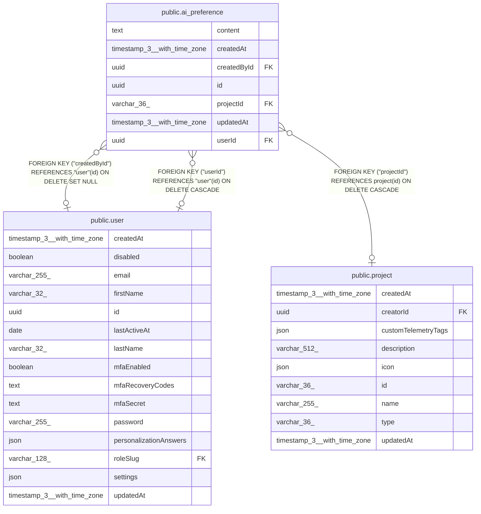

# public.ai_preference

## Columns

| Name | Type | Default | Nullable | Children | Parents | Comment |
| ---- | ---- | ------- | -------- | -------- | ------- | ------- |
| content | text |  | false |  |  | Instruction text injected into AI prompts |
| createdAt | timestamp(3) with time zone | CURRENT_TIMESTAMP(3) | false |  |  |  |
| createdById | uuid |  | true |  | [public.user](public.user.md) | Author. NULL after the author is deleted |
| id | uuid |  | false |  |  |  |
| projectId | varchar(36) |  | true |  | [public.project](public.project.md) | Set for a project preference. NULL otherwise |
| updatedAt | timestamp(3) with time zone | CURRENT_TIMESTAMP(3) | false |  |  |  |
| userId | uuid |  | true |  | [public.user](public.user.md) | Set for a personal preference. NULL otherwise |

## Constraints

| Name | Type | Definition |
| ---- | ---- | ---------- |
| CHK_ai_preference_single_target | CHECK | CHECK ((("userId" IS NULL) OR ("projectId" IS NULL))) |
| FK_4ea340a1847ad0e40a0b0360fe4 | FOREIGN KEY | FOREIGN KEY ("projectId") REFERENCES project(id) ON DELETE CASCADE |
| FK_aeb2ce3354b55bd61c8d7e17169 | FOREIGN KEY | FOREIGN KEY ("createdById") REFERENCES "user"(id) ON DELETE SET NULL |
| FK_e9059770c01bfda6062d78d9f8e | FOREIGN KEY | FOREIGN KEY ("userId") REFERENCES "user"(id) ON DELETE CASCADE |
| PK_e7dbbeec9da3e06f6a20669e6e7 | PRIMARY KEY | PRIMARY KEY (id) |
| ai_preference_content_not_null | n | NOT NULL content |
| ai_preference_createdAt_not_null | n | NOT NULL "createdAt" |
| ai_preference_id_not_null | n | NOT NULL id |
| ai_preference_updatedAt_not_null | n | NOT NULL "updatedAt" |

## Indexes

| Name | Definition |
| ---- | ---------- |
| IDX_4ea340a1847ad0e40a0b0360fe | CREATE INDEX "IDX_4ea340a1847ad0e40a0b0360fe" ON public.ai_preference USING btree ("projectId") |
| IDX_e9059770c01bfda6062d78d9f8 | CREATE INDEX "IDX_e9059770c01bfda6062d78d9f8" ON public.ai_preference USING btree ("userId") |
| PK_e7dbbeec9da3e06f6a20669e6e7 | CREATE UNIQUE INDEX "PK_e7dbbeec9da3e06f6a20669e6e7" ON public.ai_preference USING btree (id) |

## Relations

---

> Generated by [tbls](https://github.com/k1LoW/tbls)
