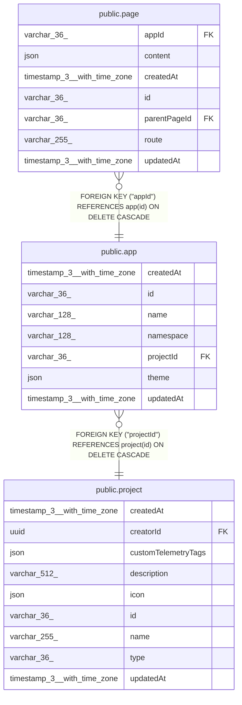

# public.app

## Columns

| Name | Type | Default | Nullable | Children | Parents | Comment |
| ---- | ---- | ------- | -------- | -------- | ------- | ------- |
| createdAt | timestamp(3) with time zone | CURRENT_TIMESTAMP(3) | false |  |  |  |
| id | varchar(36) |  | false | [public.page](public.page.md) |  |  |
| name | varchar(128) |  | false |  |  |  |
| namespace | varchar(128) |  | false |  |  | URL path segment under /apps/; unique per project |
| projectId | varchar(36) |  | false |  | [public.project](public.project.md) |  |
| theme | json |  | true |  |  | Shared colors/spacing for the App, app-defined shape |
| updatedAt | timestamp(3) with time zone | CURRENT_TIMESTAMP(3) | false |  |  |  |

## Constraints

| Name | Type | Definition |
| ---- | ---- | ---------- |
| FK_f84dd7eb539e46e0c233fa09b20 | FOREIGN KEY | FOREIGN KEY ("projectId") REFERENCES project(id) ON DELETE CASCADE |
| PK_9478629fc093d229df09e560aea | PRIMARY KEY | PRIMARY KEY (id) |
| app_createdAt_not_null | n | NOT NULL "createdAt" |
| app_id_not_null | n | NOT NULL id |
| app_name_not_null | n | NOT NULL name |
| app_namespace_not_null | n | NOT NULL namespace |
| app_projectId_not_null | n | NOT NULL "projectId" |
| app_updatedAt_not_null | n | NOT NULL "updatedAt" |

## Indexes

| Name | Definition |
| ---- | ---------- |
| IDX_app_namespace | CREATE UNIQUE INDEX "IDX_app_namespace" ON public.app USING btree (namespace) |
| PK_9478629fc093d229df09e560aea | CREATE UNIQUE INDEX "PK_9478629fc093d229df09e560aea" ON public.app USING btree (id) |

## Relations

---

> Generated by [tbls](https://github.com/k1LoW/tbls)
