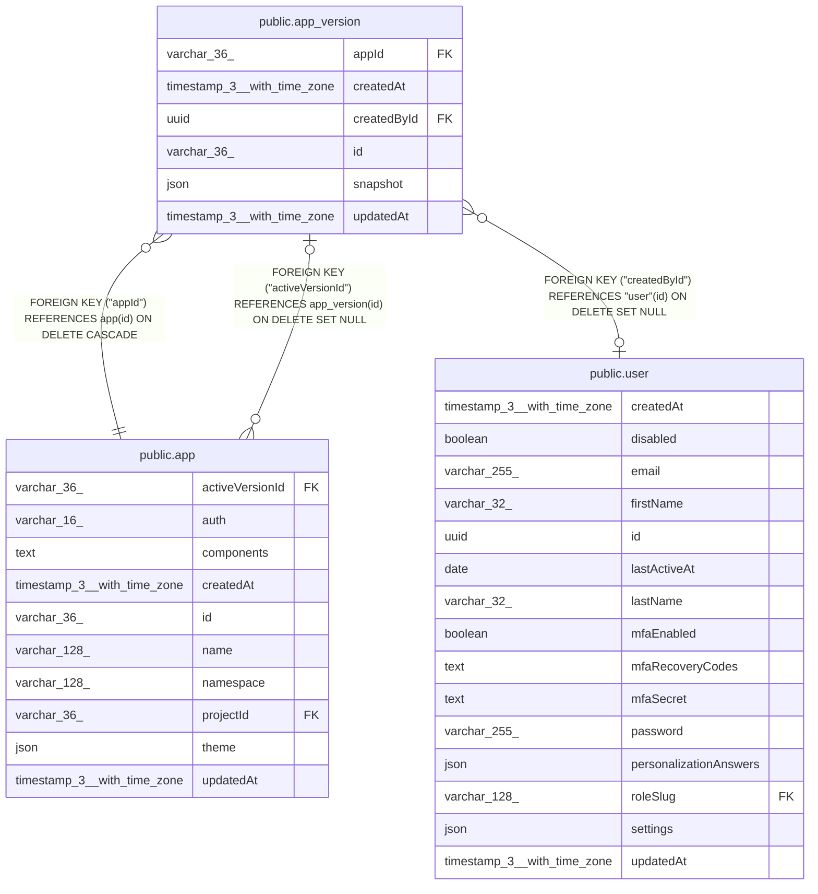

# public.app_version

## Columns

| Name | Type | Default | Nullable | Children | Parents | Comment |
| ---- | ---- | ------- | -------- | -------- | ------- | ------- |
| appId | varchar(36) |  | false |  | [public.app](public.app.md) |  |
| createdAt | timestamp(3) with time zone | CURRENT_TIMESTAMP(3) | false |  |  |  |
| createdById | uuid |  | true |  | [public.user](public.user.md) | User who published this version; null once they are deleted |
| id | varchar(36) |  | false | [public.app](public.app.md) |  |  |
| snapshot | json |  | false |  |  | Frozen page tree + theme, see AppVersionSnapshot |
| updatedAt | timestamp(3) with time zone | CURRENT_TIMESTAMP(3) | false |  |  |  |

## Constraints

| Name | Type | Definition |
| ---- | ---- | ---------- |
| FK_e4eab717688459a6681c9f67cff | FOREIGN KEY | FOREIGN KEY ("createdById") REFERENCES "user"(id) ON DELETE SET NULL |
| FK_e9aeab5b1db8dc77708231ae44e | FOREIGN KEY | FOREIGN KEY ("appId") REFERENCES app(id) ON DELETE CASCADE |
| PK_f2573b981a7eac664875e7483ac | PRIMARY KEY | PRIMARY KEY (id) |
| app_version_appId_not_null | n | NOT NULL "appId" |
| app_version_createdAt_not_null | n | NOT NULL "createdAt" |
| app_version_id_not_null | n | NOT NULL id |
| app_version_snapshot_not_null | n | NOT NULL snapshot |
| app_version_updatedAt_not_null | n | NOT NULL "updatedAt" |

## Indexes

| Name | Definition |
| ---- | ---------- |
| IDX_e9aeab5b1db8dc77708231ae44 | CREATE INDEX "IDX_e9aeab5b1db8dc77708231ae44" ON public.app_version USING btree ("appId") |
| PK_f2573b981a7eac664875e7483ac | CREATE UNIQUE INDEX "PK_f2573b981a7eac664875e7483ac" ON public.app_version USING btree (id) |

## Relations

---

> Generated by [tbls](https://github.com/k1LoW/tbls)
