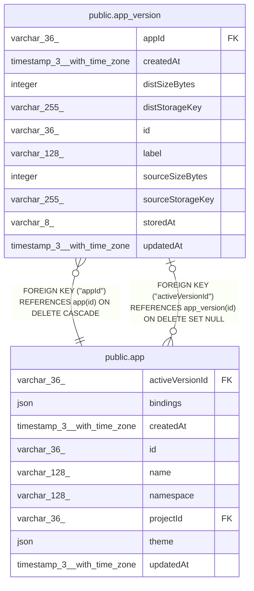

# public.app_version

## Columns

| Name | Type | Default | Nullable | Children | Parents | Comment |
| ---- | ---- | ------- | -------- | -------- | ------- | ------- |
| appId | varchar(36) |  | false |  | [public.app](public.app.md) |  |
| createdAt | timestamp(3) with time zone | CURRENT_TIMESTAMP(3) | false |  |  |  |
| distSizeBytes | integer |  | true |  |  | Size of the dist tarball, in bytes; null once pruned by retention |
| distStorageKey | varchar(255) |  | true |  |  | Blob key of the built dist tarball; null once pruned by retention |
| id | varchar(36) |  | false | [public.app](public.app.md) |  |  |
| label | varchar(128) |  | true |  |  | Short summary of what changed, set by the AI Assistant after a turn |
| sourceSizeBytes | integer | 0 | false |  |  | Size of the source tarball, in bytes |
| sourceStorageKey | varchar(255) |  | false |  |  | Blob key of the source tarball (project minus node_modules, dist, .git) |
| storedAt | varchar(8) |  | false |  |  | Execution data storage mode the tarballs were written with |
| updatedAt | timestamp(3) with time zone | CURRENT_TIMESTAMP(3) | false |  |  |  |

## Constraints

| Name | Type | Definition |
| ---- | ---- | ---------- |
| CHK_app_version_storedAt | CHECK | CHECK ((("storedAt")::text = ANY ((ARRAY['db'::character varying, 'fs'::character varying, 's3'::character varying, 'az'::character varying])::text[]))) |
| FK_e9aeab5b1db8dc77708231ae44e | FOREIGN KEY | FOREIGN KEY ("appId") REFERENCES app(id) ON DELETE CASCADE |
| PK_f2573b981a7eac664875e7483ac | PRIMARY KEY | PRIMARY KEY (id) |
| app_version_appId_not_null | n | NOT NULL "appId" |
| app_version_createdAt_not_null | n | NOT NULL "createdAt" |
| app_version_id_not_null | n | NOT NULL id |
| app_version_sourceSizeBytes_not_null | n | NOT NULL "sourceSizeBytes" |
| app_version_sourceStorageKey_not_null | n | NOT NULL "sourceStorageKey" |
| app_version_storedAt_not_null | n | NOT NULL "storedAt" |
| app_version_updatedAt_not_null | n | NOT NULL "updatedAt" |

## Indexes

| Name | Definition |
| ---- | ---------- |
| IDX_e9aeab5b1db8dc77708231ae44 | CREATE INDEX "IDX_e9aeab5b1db8dc77708231ae44" ON public.app_version USING btree ("appId") |
| PK_f2573b981a7eac664875e7483ac | CREATE UNIQUE INDEX "PK_f2573b981a7eac664875e7483ac" ON public.app_version USING btree (id) |

## Relations

---

> Generated by [tbls](https://github.com/k1LoW/tbls)
