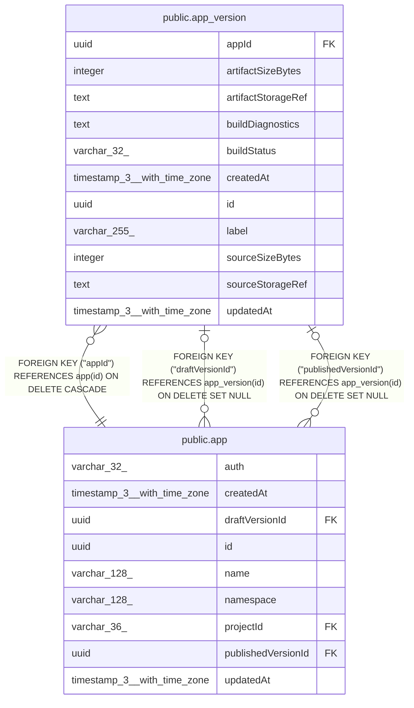

# public.app_version

## Columns

| Name | Type | Default | Nullable | Children | Parents | Comment |
| ---- | ---- | ------- | -------- | -------- | ------- | ------- |
| appId | uuid |  | false |  | [public.app](public.app.md) |  |
| artifactSizeBytes | integer |  | true |  |  |  |
| artifactStorageRef | text |  | true |  |  | Opaque reference to the built static output |
| buildDiagnostics | text |  | true |  |  | Build diagnostics, limited to 4096 characters |
| buildStatus | varchar(32) | 'queued'::character varying | false |  |  | Build state: queued, running, succeeded, or failed |
| createdAt | timestamp(3) with time zone | CURRENT_TIMESTAMP(3) | false |  |  |  |
| id | uuid |  | false | [public.app](public.app.md) |  |  |
| label | varchar(255) |  | true |  |  |  |
| sourceSizeBytes | integer |  | false |  |  |  |
| sourceStorageRef | text |  | false |  |  | Opaque reference to the saved source snapshot |
| updatedAt | timestamp(3) with time zone | CURRENT_TIMESTAMP(3) | false |  |  |  |

## Constraints

| Name | Type | Definition |
| ---- | ---- | ---------- |
| CHK_app_version_buildStatus | CHECK | CHECK ((("buildStatus")::text = ANY ((ARRAY['queued'::character varying, 'running'::character varying, 'succeeded'::character varying, 'failed'::character varying])::text[]))) |
| FK_e9aeab5b1db8dc77708231ae44e | FOREIGN KEY | FOREIGN KEY ("appId") REFERENCES app(id) ON DELETE CASCADE |
| PK_f2573b981a7eac664875e7483ac | PRIMARY KEY | PRIMARY KEY (id) |
| app_version_appId_not_null | n | NOT NULL "appId" |
| app_version_buildStatus_not_null | n | NOT NULL "buildStatus" |
| app_version_createdAt_not_null | n | NOT NULL "createdAt" |
| app_version_id_not_null | n | NOT NULL id |
| app_version_sourceSizeBytes_not_null | n | NOT NULL "sourceSizeBytes" |
| app_version_sourceStorageRef_not_null | n | NOT NULL "sourceStorageRef" |
| app_version_updatedAt_not_null | n | NOT NULL "updatedAt" |

## Indexes

| Name | Definition |
| ---- | ---------- |
| IDX_e9aeab5b1db8dc77708231ae44 | CREATE INDEX "IDX_e9aeab5b1db8dc77708231ae44" ON public.app_version USING btree ("appId") |
| PK_f2573b981a7eac664875e7483ac | CREATE UNIQUE INDEX "PK_f2573b981a7eac664875e7483ac" ON public.app_version USING btree (id) |

## Relations

```mermaid
erDiagram

"public.app_version" }o--|| "public.app" : "FOREIGN KEY (#quot;appId#quot;) REFERENCES app(id) ON DELETE CASCADE"
"public.app" }o--o| "public.app_version" : "FOREIGN KEY (#quot;draftVersionId#quot;) REFERENCES app_version(id) ON DELETE SET NULL"
"public.app" }o--o| "public.app_version" : "FOREIGN KEY (#quot;publishedVersionId#quot;) REFERENCES app_version(id) ON DELETE SET NULL"

"public.app_version" {
  uuid appId FK
  integer artifactSizeBytes
  text artifactStorageRef
  text buildDiagnostics
  varchar_32_ buildStatus
  timestamp_3__with_time_zone createdAt
  uuid id
  varchar_255_ label
  integer sourceSizeBytes
  text sourceStorageRef
  timestamp_3__with_time_zone updatedAt
}
"public.app" {
  varchar_32_ auth
  timestamp_3__with_time_zone createdAt
  uuid draftVersionId FK
  uuid id
  varchar_128_ name
  varchar_128_ namespace
  varchar_36_ projectId FK
  uuid publishedVersionId FK
  timestamp_3__with_time_zone updatedAt
}
```

---

> Generated by [tbls](https://github.com/k1LoW/tbls)
