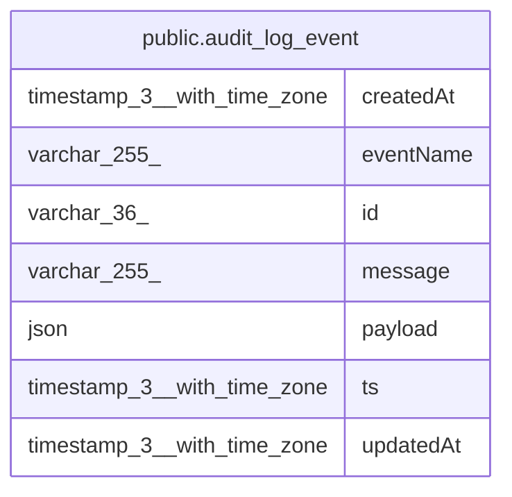

# public.audit_log_event

## Columns

| Name | Type | Default | Nullable | Children | Parents | Comment |
| ---- | ---- | ------- | -------- | -------- | ------- | ------- |
| createdAt | timestamp(3) with time zone | CURRENT_TIMESTAMP(3) | false |  |  |  |
| eventName | varchar(255) |  | false |  |  | Dotted event name, e.g. n8n.audit.* |
| id | varchar(36) |  | false |  |  | Originating EventMessage id |
| message | varchar(255) |  | false |  |  |  |
| payload | json |  | true |  |  |  |
| ts | timestamp(3) with time zone |  | false |  |  | The event's own timestamp |
| updatedAt | timestamp(3) with time zone | CURRENT_TIMESTAMP(3) | false |  |  |  |

## Constraints

| Name | Type | Definition |
| ---- | ---- | ---------- |
| PK_c37ba8970192420a944eaef393d | PRIMARY KEY | PRIMARY KEY (id) |
| audit_log_event_createdAt_not_null | n | NOT NULL "createdAt" |
| audit_log_event_eventName_not_null | n | NOT NULL "eventName" |
| audit_log_event_id_not_null | n | NOT NULL id |
| audit_log_event_message_not_null | n | NOT NULL message |
| audit_log_event_ts_not_null | n | NOT NULL ts |
| audit_log_event_updatedAt_not_null | n | NOT NULL "updatedAt" |

## Indexes

| Name | Definition |
| ---- | ---------- |
| IDX_ea9ed51f539d2ca4ba8e4fe342 | CREATE INDEX "IDX_ea9ed51f539d2ca4ba8e4fe342" ON public.audit_log_event USING btree ("eventName") |
| PK_c37ba8970192420a944eaef393d | CREATE UNIQUE INDEX "PK_c37ba8970192420a944eaef393d" ON public.audit_log_event USING btree (id) |

## Relations

---

> Generated by [tbls](https://github.com/k1LoW/tbls)
