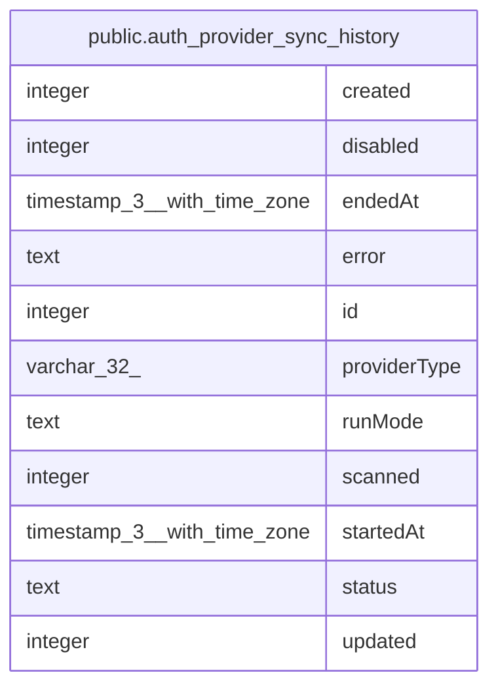

# public.auth_provider_sync_history

## Columns

| Name | Type | Default | Nullable | Children | Parents | Comment |
| ---- | ---- | ------- | -------- | -------- | ------- | ------- |
| created | integer |  | false |  |  |  |
| disabled | integer |  | false |  |  |  |
| endedAt | timestamp(3) with time zone | CURRENT_TIMESTAMP | false |  |  |  |
| error | text |  | true |  |  |  |
| id | integer | nextval('auth_provider_sync_history_id_seq'::regclass) | false |  |  |  |
| providerType | varchar(32) |  | false |  |  |  |
| runMode | text |  | false |  |  |  |
| scanned | integer |  | false |  |  |  |
| startedAt | timestamp(3) with time zone | CURRENT_TIMESTAMP | false |  |  |  |
| status | text |  | false |  |  |  |
| updated | integer |  | false |  |  |  |

## Constraints

| Name | Type | Definition |
| ---- | ---- | ---------- |
| auth_provider_sync_history_created_not_null | n | NOT NULL created |
| auth_provider_sync_history_disabled_not_null | n | NOT NULL disabled |
| auth_provider_sync_history_endedAt_not_null | n | NOT NULL "endedAt" |
| auth_provider_sync_history_id_not_null | n | NOT NULL id |
| auth_provider_sync_history_pkey | PRIMARY KEY | PRIMARY KEY (id) |
| auth_provider_sync_history_providerType_not_null | n | NOT NULL "providerType" |
| auth_provider_sync_history_runMode_not_null | n | NOT NULL "runMode" |
| auth_provider_sync_history_scanned_not_null | n | NOT NULL scanned |
| auth_provider_sync_history_startedAt_not_null | n | NOT NULL "startedAt" |
| auth_provider_sync_history_status_not_null | n | NOT NULL status |
| auth_provider_sync_history_updated_not_null | n | NOT NULL updated |

## Indexes

| Name | Definition |
| ---- | ---------- |
| auth_provider_sync_history_pkey | CREATE UNIQUE INDEX auth_provider_sync_history_pkey ON public.auth_provider_sync_history USING btree (id) |

## Relations

---

> Generated by [tbls](https://github.com/k1LoW/tbls)
