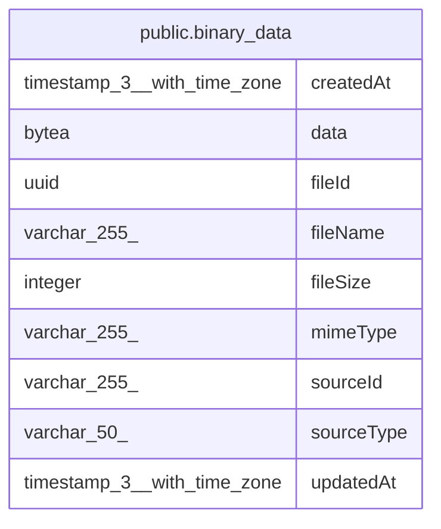

# public.binary_data

## Columns

| Name | Type | Default | Nullable | Children | Parents | Comment |
| ---- | ---- | ------- | -------- | -------- | ------- | ------- |
| createdAt | timestamp(3) with time zone | CURRENT_TIMESTAMP(3) | false |  |  |  |
| data | bytea |  | false |  |  | Raw, not base64 encoded |
| fileId | uuid |  | false |  |  |  |
| fileName | varchar(255) |  | true |  |  |  |
| fileSize | integer |  | false |  |  | In bytes |
| mimeType | varchar(255) |  | true |  |  |  |
| sourceId | varchar(255) |  | false |  |  | ID of the source, e.g. execution ID |
| sourceType | varchar(50) |  | false |  |  | Source the file belongs to, e.g. 'execution' |
| updatedAt | timestamp(3) with time zone | CURRENT_TIMESTAMP(3) | false |  |  |  |

## Constraints

| Name | Type | Definition |
| ---- | ---- | ---------- |
| CHK_binary_data_sourceType | CHECK | CHECK ((("sourceType")::text = ANY ((ARRAY['execution'::character varying, 'chat_message_attachment'::character varying, 'agent_file'::character varying])::text[]))) |
| PK_fc3691585b39408bb0551122af6 | PRIMARY KEY | PRIMARY KEY ("fileId") |
| binary_data_createdAt_not_null | n | NOT NULL "createdAt" |
| binary_data_data_not_null | n | NOT NULL data |
| binary_data_fileId_not_null | n | NOT NULL "fileId" |
| binary_data_fileSize_not_null | n | NOT NULL "fileSize" |
| binary_data_sourceId_not_null | n | NOT NULL "sourceId" |
| binary_data_sourceType_not_null | n | NOT NULL "sourceType" |
| binary_data_updatedAt_not_null | n | NOT NULL "updatedAt" |

## Indexes

| Name | Definition |
| ---- | ---------- |
| IDX_56900edc3cfd16612e2ef2c6a8 | CREATE INDEX "IDX_56900edc3cfd16612e2ef2c6a8" ON public.binary_data USING btree ("sourceType", "sourceId") |
| PK_fc3691585b39408bb0551122af6 | CREATE UNIQUE INDEX "PK_fc3691585b39408bb0551122af6" ON public.binary_data USING btree ("fileId") |

## Relations

---

> Generated by [tbls](https://github.com/k1LoW/tbls)
