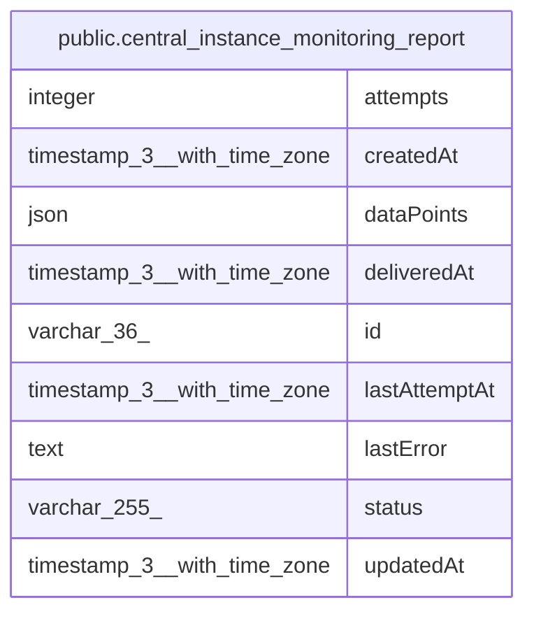

# public.central_instance_monitoring_report

## Columns

| Name | Type | Default | Nullable | Children | Parents | Comment |
| ---- | ---- | ------- | -------- | -------- | ------- | ------- |
| attempts | integer | 0 | false |  |  | Delivery attempts made so far, successful or not. Three ends the report. |
| createdAt | timestamp(3) with time zone | CURRENT_TIMESTAMP(3) | false |  |  |  |
| dataPoints | json |  | false |  |  | The data point array exactly as sent to the receiver. |
| deliveredAt | timestamp(3) with time zone |  | true |  |  | When the receiver accepted the report; NULL while undelivered. |
| id | varchar(36) |  | false |  |  | Nanoid; travels with the payload as its `batchId`. |
| lastAttemptAt | timestamp(3) with time zone |  | true |  |  | When the last attempt finished; NULL before the first. Paces retries across a restart. |
| lastError | text |  | true |  |  | Message of the most recent delivery failure. |
| status | varchar(255) | 'pending'::character varying | false |  |  | Skipped means the instance stopped trying that day, not that the numbers were lost: only a delivered report crosses a day off, so a skipped day is covered by the next report. |
| updatedAt | timestamp(3) with time zone | CURRENT_TIMESTAMP(3) | false |  |  |  |

## Constraints

| Name | Type | Definition |
| ---- | ---- | ---------- |
| CHK_central_instance_monitoring_report_status | CHECK | CHECK (((status)::text = ANY ((ARRAY['pending'::character varying, 'delivered'::character varying, 'skipped_after_max_retries'::character varying])::text[]))) |
| PK_813b97cbafab6a2ac45aa10de6a | PRIMARY KEY | PRIMARY KEY (id) |
| central_instance_monitoring_report_attempts_not_null | n | NOT NULL attempts |
| central_instance_monitoring_report_createdAt_not_null | n | NOT NULL "createdAt" |
| central_instance_monitoring_report_dataPoints_not_null | n | NOT NULL "dataPoints" |
| central_instance_monitoring_report_id_not_null | n | NOT NULL id |
| central_instance_monitoring_report_status_not_null | n | NOT NULL status |
| central_instance_monitoring_report_updatedAt_not_null | n | NOT NULL "updatedAt" |

## Indexes

| Name | Definition |
| ---- | ---------- |
| PK_813b97cbafab6a2ac45aa10de6a | CREATE UNIQUE INDEX "PK_813b97cbafab6a2ac45aa10de6a" ON public.central_instance_monitoring_report USING btree (id) |

## Relations

---

> Generated by [tbls](https://github.com/k1LoW/tbls)
