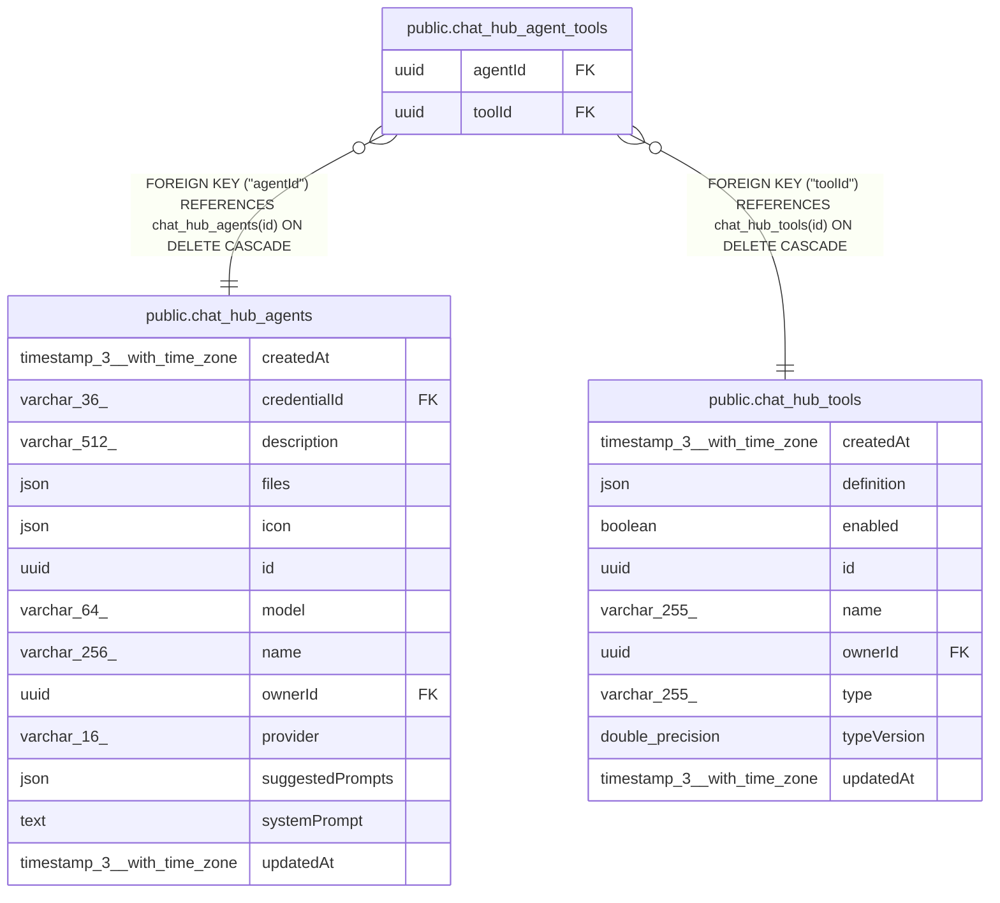

# public.chat_hub_agent_tools

## Columns

| Name | Type | Default | Nullable | Children | Parents | Comment |
| ---- | ---- | ------- | -------- | -------- | ------- | ------- |
| agentId | uuid |  | false |  | [public.chat_hub_agents](public.chat_hub_agents.md) |  |
| toolId | uuid |  | false |  | [public.chat_hub_tools](public.chat_hub_tools.md) |  |

## Constraints

| Name | Type | Definition |
| ---- | ---- | ---------- |
| FK_2b53d796b3dbae91b1a9553c048 | FOREIGN KEY | FOREIGN KEY ("agentId") REFERENCES chat_hub_agents(id) ON DELETE CASCADE |
| FK_43e70f04c53344f82483d0570f6 | FOREIGN KEY | FOREIGN KEY ("toolId") REFERENCES chat_hub_tools(id) ON DELETE CASCADE |
| PK_cc8806fdea48297a7d497035d72 | PRIMARY KEY | PRIMARY KEY ("agentId", "toolId") |
| chat_hub_agent_tools_agentId_not_null | n | NOT NULL "agentId" |
| chat_hub_agent_tools_toolId_not_null | n | NOT NULL "toolId" |

## Indexes

| Name | Definition |
| ---- | ---------- |
| PK_cc8806fdea48297a7d497035d72 | CREATE UNIQUE INDEX "PK_cc8806fdea48297a7d497035d72" ON public.chat_hub_agent_tools USING btree ("agentId", "toolId") |

## Relations

---

> Generated by [tbls](https://github.com/k1LoW/tbls)
