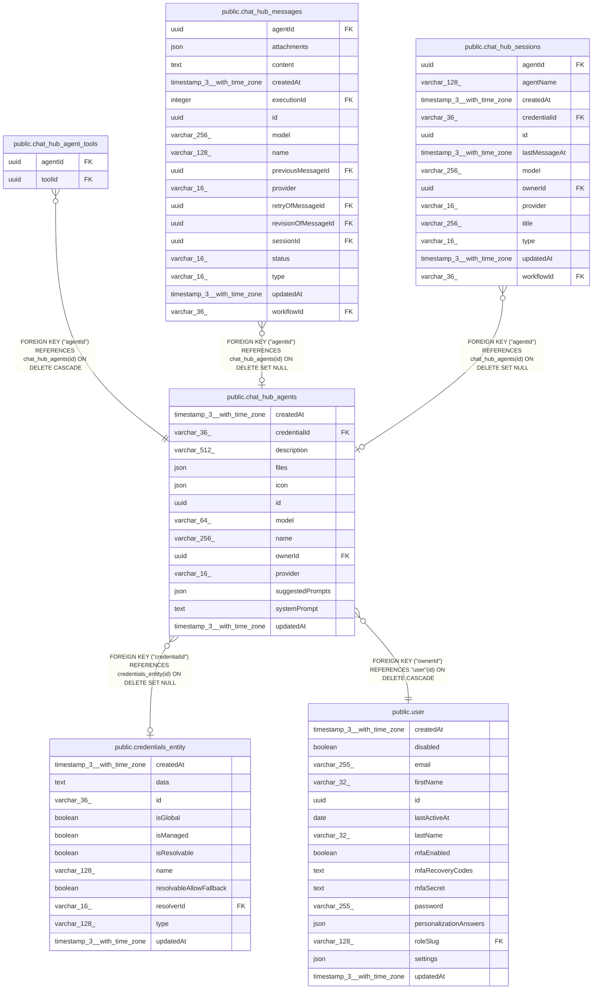

# public.chat_hub_agents

## Columns

| Name | Type | Default | Nullable | Children | Parents | Comment |
| ---- | ---- | ------- | -------- | -------- | ------- | ------- |
| createdAt | timestamp(3) with time zone | CURRENT_TIMESTAMP(3) | false |  |  |  |
| credentialId | varchar(36) |  | true |  | [public.credentials_entity](public.credentials_entity.md) |  |
| description | varchar(512) |  | true |  |  |  |
| files | json | '[]'::json | false |  |  |  |
| icon | json |  | true |  |  |  |
| id | uuid |  | false | [public.chat_hub_agent_tools](public.chat_hub_agent_tools.md) [public.chat_hub_messages](public.chat_hub_messages.md) [public.chat_hub_sessions](public.chat_hub_sessions.md) |  |  |
| model | varchar(64) |  | false |  |  | Model name used at the respective Model node, ie. "gpt-4" |
| name | varchar(256) |  | false |  |  |  |
| ownerId | uuid |  | false |  | [public.user](public.user.md) |  |
| provider | varchar(16) |  | false |  |  | ChatHubProvider enum: "openai", "anthropic", "google", "n8n" |
| suggestedPrompts | json | '[]'::json | false |  |  |  |
| systemPrompt | text |  | false |  |  |  |
| updatedAt | timestamp(3) with time zone | CURRENT_TIMESTAMP(3) | false |  |  |  |

## Constraints

| Name | Type | Definition |
| ---- | ---- | ---------- |
| FK_441ba2caba11e077ce3fbfa2cd8 | FOREIGN KEY | FOREIGN KEY ("ownerId") REFERENCES "user"(id) ON DELETE CASCADE |
| FK_9c61ad497dcbae499c96a6a78ba | FOREIGN KEY | FOREIGN KEY ("credentialId") REFERENCES credentials_entity(id) ON DELETE SET NULL |
| PK_f39a3b36bbdf0e2979ddb21cf78 | PRIMARY KEY | PRIMARY KEY (id) |
| chat_hub_agents_createdAt_not_null | n | NOT NULL "createdAt" |
| chat_hub_agents_files_not_null | n | NOT NULL files |
| chat_hub_agents_id_not_null | n | NOT NULL id |
| chat_hub_agents_model_not_null | n | NOT NULL model |
| chat_hub_agents_name_not_null | n | NOT NULL name |
| chat_hub_agents_ownerId_not_null | n | NOT NULL "ownerId" |
| chat_hub_agents_provider_not_null | n | NOT NULL provider |
| chat_hub_agents_suggestedPrompts_not_null | n | NOT NULL "suggestedPrompts" |
| chat_hub_agents_systemPrompt_not_null | n | NOT NULL "systemPrompt" |
| chat_hub_agents_updatedAt_not_null | n | NOT NULL "updatedAt" |

## Indexes

| Name | Definition |
| ---- | ---------- |
| PK_f39a3b36bbdf0e2979ddb21cf78 | CREATE UNIQUE INDEX "PK_f39a3b36bbdf0e2979ddb21cf78" ON public.chat_hub_agents USING btree (id) |

## Relations

---

> Generated by [tbls](https://github.com/k1LoW/tbls)
