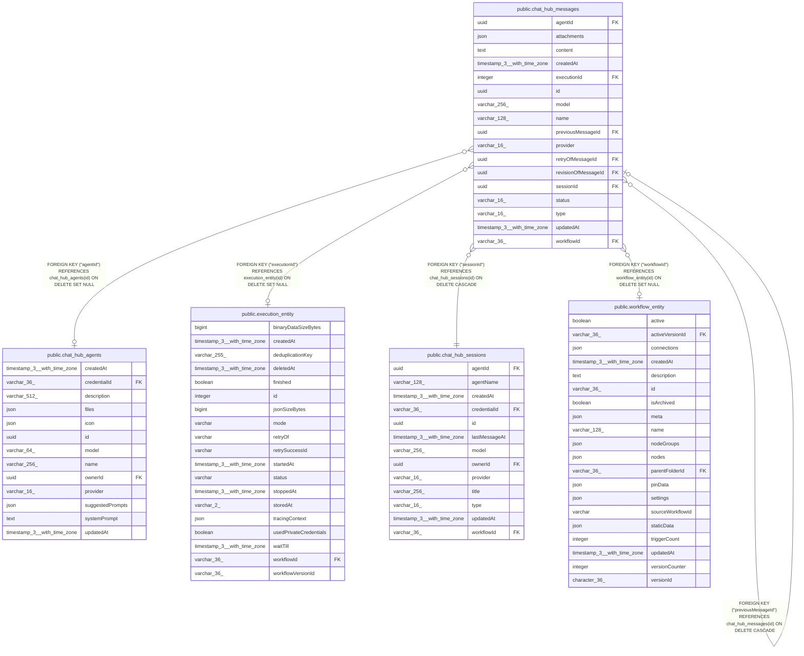

# public.chat_hub_messages

## Columns

| Name | Type | Default | Nullable | Children | Parents | Comment |
| ---- | ---- | ------- | -------- | -------- | ------- | ------- |
| agentId | uuid |  | true |  | [public.chat_hub_agents](public.chat_hub_agents.md) | ID of the custom agent (if provider is "custom-agent") |
| attachments | json |  | true |  |  | File attachments for the message (if any), stored as JSON. Files are stored as base64-encoded data URLs. |
| content | text |  | false |  |  |  |
| createdAt | timestamp(3) with time zone | CURRENT_TIMESTAMP(3) | false |  |  |  |
| executionId | integer |  | true |  | [public.execution_entity](public.execution_entity.md) |  |
| id | uuid |  | false | [public.chat_hub_messages](public.chat_hub_messages.md) |  |  |
| model | varchar(256) |  | true |  |  | Model name used at the respective Model node, ie. "gpt-4" |
| name | varchar(128) |  | false |  |  |  |
| previousMessageId | uuid |  | true |  | [public.chat_hub_messages](public.chat_hub_messages.md) |  |
| provider | varchar(16) |  | true |  |  | ChatHubProvider enum: "openai", "anthropic", "google", "n8n" |
| retryOfMessageId | uuid |  | true |  | [public.chat_hub_messages](public.chat_hub_messages.md) |  |
| revisionOfMessageId | uuid |  | true |  | [public.chat_hub_messages](public.chat_hub_messages.md) |  |
| sessionId | uuid |  | false |  | [public.chat_hub_sessions](public.chat_hub_sessions.md) |  |
| status | varchar(16) | 'success'::character varying | false |  |  | ChatHubMessageStatus enum, eg. "success", "error", "running", "cancelled" |
| type | varchar(16) |  | false |  |  | ChatHubMessageType enum: "human", "ai", "system", "tool", "generic" |
| updatedAt | timestamp(3) with time zone | CURRENT_TIMESTAMP(3) | false |  |  |  |
| workflowId | varchar(36) |  | true |  | [public.workflow_entity](public.workflow_entity.md) |  |

## Constraints

| Name | Type | Definition |
| ---- | ---- | ---------- |
| FK_1f4998c8a7dec9e00a9ab15550e | FOREIGN KEY | FOREIGN KEY ("revisionOfMessageId") REFERENCES chat_hub_messages(id) ON DELETE CASCADE |
| FK_25c9736e7f769f3a005eef4b372 | FOREIGN KEY | FOREIGN KEY ("retryOfMessageId") REFERENCES chat_hub_messages(id) ON DELETE CASCADE |
| FK_6afb260449dd7a9b85355d4e0c9 | FOREIGN KEY | FOREIGN KEY ("executionId") REFERENCES execution_entity(id) ON DELETE SET NULL |
| FK_acf8926098f063cdbbad8497fd1 | FOREIGN KEY | FOREIGN KEY ("workflowId") REFERENCES workflow_entity(id) ON DELETE SET NULL |
| FK_chat_hub_messages_agentId | FOREIGN KEY | FOREIGN KEY ("agentId") REFERENCES chat_hub_agents(id) ON DELETE SET NULL |
| FK_e22538eb50a71a17954cd7e076c | FOREIGN KEY | FOREIGN KEY ("sessionId") REFERENCES chat_hub_sessions(id) ON DELETE CASCADE |
| FK_e5d1fa722c5a8d38ac204746662 | FOREIGN KEY | FOREIGN KEY ("previousMessageId") REFERENCES chat_hub_messages(id) ON DELETE CASCADE |
| PK_7704a5add6baed43eef835f0bfb | PRIMARY KEY | PRIMARY KEY (id) |
| chat_hub_messages_content_not_null | n | NOT NULL content |
| chat_hub_messages_createdAt_not_null | n | NOT NULL "createdAt" |
| chat_hub_messages_id_not_null | n | NOT NULL id |
| chat_hub_messages_name_not_null | n | NOT NULL name |
| chat_hub_messages_sessionId_not_null | n | NOT NULL "sessionId" |
| chat_hub_messages_status_not_null | n | NOT NULL status |
| chat_hub_messages_type_not_null | n | NOT NULL type |
| chat_hub_messages_updatedAt_not_null | n | NOT NULL "updatedAt" |

## Indexes

| Name | Definition |
| ---- | ---------- |
| IDX_chat_hub_messages_sessionId | CREATE INDEX "IDX_chat_hub_messages_sessionId" ON public.chat_hub_messages USING btree ("sessionId") |
| PK_7704a5add6baed43eef835f0bfb | CREATE UNIQUE INDEX "PK_7704a5add6baed43eef835f0bfb" ON public.chat_hub_messages USING btree (id) |

## Relations

---

> Generated by [tbls](https://github.com/k1LoW/tbls)
