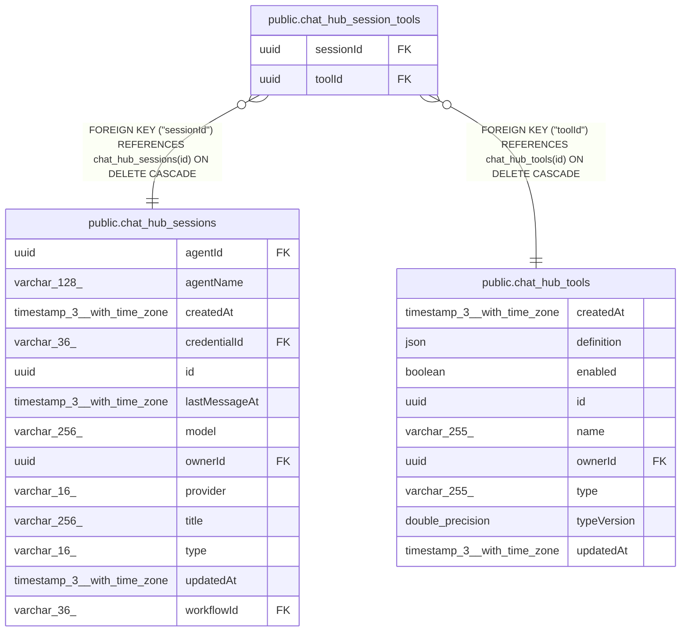

# public.chat_hub_session_tools

## Columns

| Name | Type | Default | Nullable | Children | Parents | Comment |
| ---- | ---- | ------- | -------- | -------- | ------- | ------- |
| sessionId | uuid |  | false |  | [public.chat_hub_sessions](public.chat_hub_sessions.md) |  |
| toolId | uuid |  | false |  | [public.chat_hub_tools](public.chat_hub_tools.md) |  |

## Constraints

| Name | Type | Definition |
| ---- | ---- | ---------- |
| FK_6596a328affd8d4967ffb303eee | FOREIGN KEY | FOREIGN KEY ("toolId") REFERENCES chat_hub_tools(id) ON DELETE CASCADE |
| FK_e649bf1295f4ed8d4299ed290f9 | FOREIGN KEY | FOREIGN KEY ("sessionId") REFERENCES chat_hub_sessions(id) ON DELETE CASCADE |
| PK_87aea76ff4c274c4a5ac838ebe3 | PRIMARY KEY | PRIMARY KEY ("sessionId", "toolId") |
| chat_hub_session_tools_sessionId_not_null | n | NOT NULL "sessionId" |
| chat_hub_session_tools_toolId_not_null | n | NOT NULL "toolId" |

## Indexes

| Name | Definition |
| ---- | ---------- |
| PK_87aea76ff4c274c4a5ac838ebe3 | CREATE UNIQUE INDEX "PK_87aea76ff4c274c4a5ac838ebe3" ON public.chat_hub_session_tools USING btree ("sessionId", "toolId") |

## Relations

---

> Generated by [tbls](https://github.com/k1LoW/tbls)
