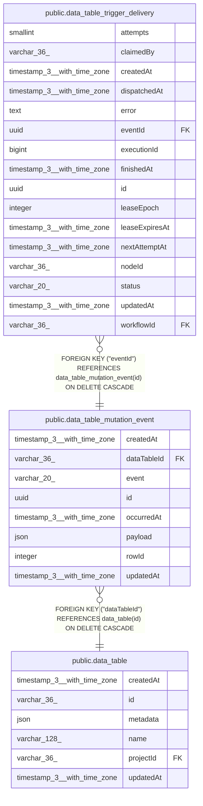

# public.data_table_mutation_event

## Columns

| Name | Type | Default | Nullable | Children | Parents | Comment |
| ---- | ---- | ------- | -------- | -------- | ------- | ------- |
| createdAt | timestamp(3) with time zone | CURRENT_TIMESTAMP(3) | false |  |  |  |
| dataTableId | varchar(36) |  | false |  | [public.data_table](public.data_table.md) |  |
| event | varchar(20) |  | false |  |  | Committed Data Table row mutation |
| id | uuid |  | false | [public.data_table_trigger_delivery](public.data_table_trigger_delivery.md) |  |  |
| occurredAt | timestamp(3) with time zone |  | false |  |  |  |
| payload | json |  | false |  |  | Immutable trigger payload for the row mutation |
| rowId | integer |  | false |  |  |  |
| updatedAt | timestamp(3) with time zone | CURRENT_TIMESTAMP(3) | false |  |  |  |

## Constraints

| Name | Type | Definition |
| ---- | ---- | ---------- |
| CHK_data_table_mutation_event_event | CHECK | CHECK (((event)::text = ANY ((ARRAY['rowInserted'::character varying, 'rowDeleted'::character varying, 'columnUpdated'::character varying])::text[]))) |
| FK_7c5ffce6d8884e133346c02cd4f | FOREIGN KEY | FOREIGN KEY ("dataTableId") REFERENCES data_table(id) ON DELETE CASCADE |
| PK_8c5d436f1bd0bf9e6108c6d298a | PRIMARY KEY | PRIMARY KEY (id) |
| data_table_mutation_event_createdAt_not_null | n | NOT NULL "createdAt" |
| data_table_mutation_event_dataTableId_not_null | n | NOT NULL "dataTableId" |
| data_table_mutation_event_event_not_null | n | NOT NULL event |
| data_table_mutation_event_id_not_null | n | NOT NULL id |
| data_table_mutation_event_occurredAt_not_null | n | NOT NULL "occurredAt" |
| data_table_mutation_event_payload_not_null | n | NOT NULL payload |
| data_table_mutation_event_rowId_not_null | n | NOT NULL "rowId" |
| data_table_mutation_event_updatedAt_not_null | n | NOT NULL "updatedAt" |

## Indexes

| Name | Definition |
| ---- | ---------- |
| IDX_360aead58201e2b383dd3f2eef | CREATE INDEX "IDX_360aead58201e2b383dd3f2eef" ON public.data_table_mutation_event USING btree ("dataTableId", "occurredAt") |
| PK_8c5d436f1bd0bf9e6108c6d298a | CREATE UNIQUE INDEX "PK_8c5d436f1bd0bf9e6108c6d298a" ON public.data_table_mutation_event USING btree (id) |

## Relations

---

> Generated by [tbls](https://github.com/k1LoW/tbls)
