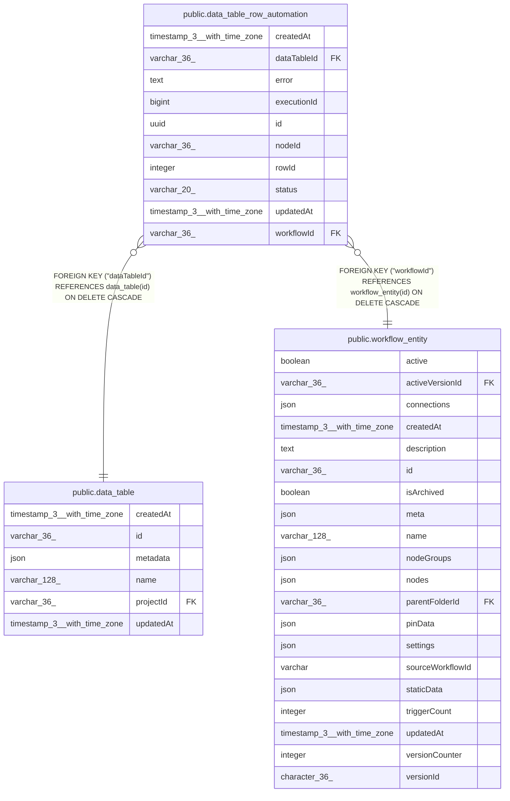

# public.data_table_row_automation

## Columns

| Name | Type | Default | Nullable | Children | Parents | Comment |
| ---- | ---- | ------- | -------- | -------- | ------- | ------- |
| createdAt | timestamp(3) with time zone | CURRENT_TIMESTAMP(3) | false |  |  |  |
| dataTableId | varchar(36) |  | false |  | [public.data_table](public.data_table.md) |  |
| error | text |  | true |  |  |  |
| executionId | bigint |  | true |  |  |  |
| id | uuid |  | false |  |  |  |
| nodeId | varchar(36) |  | false |  |  |  |
| rowId | integer |  | false |  |  |  |
| status | varchar(20) |  | false |  |  | Latest state of the trigger execution for this row |
| updatedAt | timestamp(3) with time zone | CURRENT_TIMESTAMP(3) | false |  |  |  |
| workflowId | varchar(36) |  | false |  | [public.workflow_entity](public.workflow_entity.md) |  |

## Constraints

| Name | Type | Definition |
| ---- | ---- | ---------- |
| CHK_data_table_row_automation_status | CHECK | CHECK (((status)::text = ANY ((ARRAY['waiting'::character varying, 'running'::character varying, 'finished'::character varying, 'failed'::character varying])::text[]))) |
| FK_66292e542ac173146086c447761 | FOREIGN KEY | FOREIGN KEY ("dataTableId") REFERENCES data_table(id) ON DELETE CASCADE |
| FK_9f166136def16e0128f84ccc6ac | FOREIGN KEY | FOREIGN KEY ("workflowId") REFERENCES workflow_entity(id) ON DELETE CASCADE |
| PK_9dbb7db978d99f7a13bf349493d | PRIMARY KEY | PRIMARY KEY (id) |
| UQ_132deb2c57e7ed9c3739c69c872 | UNIQUE | UNIQUE ("dataTableId", "rowId", "workflowId", "nodeId") |
| data_table_row_automation_createdAt_not_null | n | NOT NULL "createdAt" |
| data_table_row_automation_dataTableId_not_null | n | NOT NULL "dataTableId" |
| data_table_row_automation_id_not_null | n | NOT NULL id |
| data_table_row_automation_nodeId_not_null | n | NOT NULL "nodeId" |
| data_table_row_automation_rowId_not_null | n | NOT NULL "rowId" |
| data_table_row_automation_status_not_null | n | NOT NULL status |
| data_table_row_automation_updatedAt_not_null | n | NOT NULL "updatedAt" |
| data_table_row_automation_workflowId_not_null | n | NOT NULL "workflowId" |

## Indexes

| Name | Definition |
| ---- | ---------- |
| IDX_50fce52f4e26dd733feb811718 | CREATE INDEX "IDX_50fce52f4e26dd733feb811718" ON public.data_table_row_automation USING btree ("executionId") |
| IDX_66e73da1f949e1207d2d5eb2f3 | CREATE INDEX "IDX_66e73da1f949e1207d2d5eb2f3" ON public.data_table_row_automation USING btree ("workflowId", "nodeId") |
| PK_9dbb7db978d99f7a13bf349493d | CREATE UNIQUE INDEX "PK_9dbb7db978d99f7a13bf349493d" ON public.data_table_row_automation USING btree (id) |
| UQ_132deb2c57e7ed9c3739c69c872 | CREATE UNIQUE INDEX "UQ_132deb2c57e7ed9c3739c69c872" ON public.data_table_row_automation USING btree ("dataTableId", "rowId", "workflowId", "nodeId") |

## Relations

---

> Generated by [tbls](https://github.com/k1LoW/tbls)
