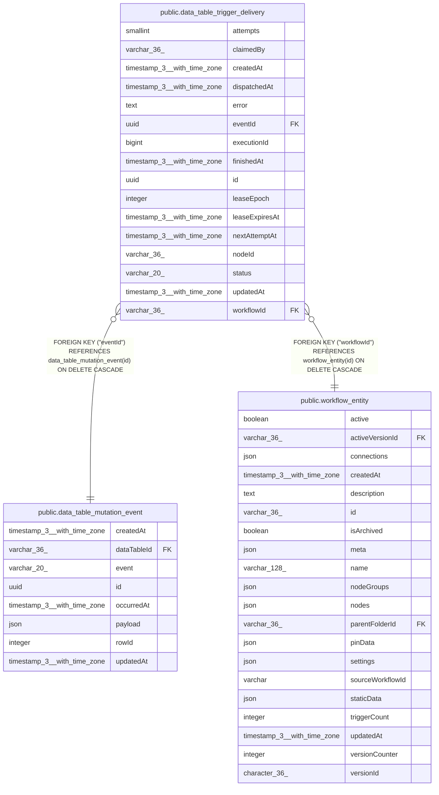

# public.data_table_trigger_delivery

## Columns

| Name | Type | Default | Nullable | Children | Parents | Comment |
| ---- | ---- | ------- | -------- | -------- | ------- | ------- |
| attempts | smallint | 0 | false |  |  |  |
| claimedBy | varchar(36) |  | true |  |  |  |
| createdAt | timestamp(3) with time zone | CURRENT_TIMESTAMP(3) | false |  |  |  |
| dispatchedAt | timestamp(3) with time zone |  | true |  |  |  |
| error | text |  | true |  |  |  |
| eventId | uuid |  | false |  | [public.data_table_mutation_event](public.data_table_mutation_event.md) |  |
| executionId | bigint |  | true |  |  |  |
| finishedAt | timestamp(3) with time zone |  | true |  |  |  |
| id | uuid |  | false |  |  |  |
| leaseEpoch | integer | 0 | false |  |  |  |
| leaseExpiresAt | timestamp(3) with time zone |  | true |  |  |  |
| nextAttemptAt | timestamp(3) with time zone |  | true |  |  |  |
| nodeId | varchar(36) |  | false |  |  |  |
| status | varchar(20) | 'pending'::character varying | false |  |  | Current durable delivery state |
| updatedAt | timestamp(3) with time zone | CURRENT_TIMESTAMP(3) | false |  |  |  |
| workflowId | varchar(36) |  | false |  | [public.workflow_entity](public.workflow_entity.md) |  |

## Constraints

| Name | Type | Definition |
| ---- | ---- | ---------- |
| CHK_data_table_trigger_delivery_status | CHECK | CHECK (((status)::text = ANY ((ARRAY['pending'::character varying, 'in_progress'::character varying, 'completed'::character varying, 'failed'::character varying, 'cancelled'::character varying])::text[]))) |
| FK_5079e141c03d20351c77f448f3f | FOREIGN KEY | FOREIGN KEY ("eventId") REFERENCES data_table_mutation_event(id) ON DELETE CASCADE |
| FK_b86b6af91fde38c7ac54ddcb1f1 | FOREIGN KEY | FOREIGN KEY ("workflowId") REFERENCES workflow_entity(id) ON DELETE CASCADE |
| PK_2a9ed24a4d7295594cb7c4e0a4d | PRIMARY KEY | PRIMARY KEY (id) |
| UQ_0af41babdfeb8a2bfb0d4124c34 | UNIQUE | UNIQUE ("eventId", "workflowId", "nodeId") |
| data_table_trigger_delivery_attempts_not_null | n | NOT NULL attempts |
| data_table_trigger_delivery_createdAt_not_null | n | NOT NULL "createdAt" |
| data_table_trigger_delivery_eventId_not_null | n | NOT NULL "eventId" |
| data_table_trigger_delivery_id_not_null | n | NOT NULL id |
| data_table_trigger_delivery_leaseEpoch_not_null | n | NOT NULL "leaseEpoch" |
| data_table_trigger_delivery_nodeId_not_null | n | NOT NULL "nodeId" |
| data_table_trigger_delivery_status_not_null | n | NOT NULL status |
| data_table_trigger_delivery_updatedAt_not_null | n | NOT NULL "updatedAt" |
| data_table_trigger_delivery_workflowId_not_null | n | NOT NULL "workflowId" |

## Indexes

| Name | Definition |
| ---- | ---------- |
| IDX_07257c339f9efa6b57a09b7d0e | CREATE INDEX "IDX_07257c339f9efa6b57a09b7d0e" ON public.data_table_trigger_delivery USING btree (status, "leaseExpiresAt", id) |
| IDX_722b26cfcf8ed1ca5273023d5c | CREATE INDEX "IDX_722b26cfcf8ed1ca5273023d5c" ON public.data_table_trigger_delivery USING btree (status, "nextAttemptAt", id) |
| IDX_8760fa6fa0aba065fdddb262de | CREATE INDEX "IDX_8760fa6fa0aba065fdddb262de" ON public.data_table_trigger_delivery USING btree ("executionId") |
| IDX_b86b6af91fde38c7ac54ddcb1f | CREATE INDEX "IDX_b86b6af91fde38c7ac54ddcb1f" ON public.data_table_trigger_delivery USING btree ("workflowId") |
| PK_2a9ed24a4d7295594cb7c4e0a4d | CREATE UNIQUE INDEX "PK_2a9ed24a4d7295594cb7c4e0a4d" ON public.data_table_trigger_delivery USING btree (id) |
| UQ_0af41babdfeb8a2bfb0d4124c34 | CREATE UNIQUE INDEX "UQ_0af41babdfeb8a2bfb0d4124c34" ON public.data_table_trigger_delivery USING btree ("eventId", "workflowId", "nodeId") |

## Relations

---

> Generated by [tbls](https://github.com/k1LoW/tbls)
