# public.data_table_trigger_subscription

## Columns

| Name | Type | Default | Nullable | Children | Parents | Comment |
| ---- | ---- | ------- | -------- | -------- | ------- | ------- |
| columnId | varchar(36) |  | true |  | [public.data_table_column](public.data_table_column.md) |  |
| createdAt | timestamp(3) with time zone | CURRENT_TIMESTAMP(3) | false |  |  |  |
| dataTableId | varchar(36) |  | false |  | [public.data_table](public.data_table.md) |  |
| event | varchar(20) |  | false |  |  | Data Table row mutation that creates a delivery |
| id | uuid |  | false |  |  |  |
| nodeId | varchar(36) |  | false |  |  |  |
| projectId | varchar(36) |  | false |  | [public.project](public.project.md) |  |
| updatedAt | timestamp(3) with time zone | CURRENT_TIMESTAMP(3) | false |  |  |  |
| workflowId | varchar(36) |  | false |  | [public.workflow_entity](public.workflow_entity.md) |  |

## Constraints

| Name | Type | Definition |
| ---- | ---- | ---------- |
| CHK_data_table_trigger_subscription_event | CHECK | CHECK (((event)::text = ANY ((ARRAY['rowInserted'::character varying, 'rowDeleted'::character varying, 'columnUpdated'::character varying])::text[]))) |
| FK_23f10731bb1e0cb94ffcb1c8db7 | FOREIGN KEY | FOREIGN KEY ("dataTableId") REFERENCES data_table(id) ON DELETE CASCADE |
| FK_4006d5dd027167fc517794c0954 | FOREIGN KEY | FOREIGN KEY ("workflowId") REFERENCES workflow_entity(id) ON DELETE CASCADE |
| FK_d8909cbd3a595db56d8defd41a6 | FOREIGN KEY | FOREIGN KEY ("projectId") REFERENCES project(id) ON DELETE CASCADE |
| FK_eece6d08ab66141283aaa2909f6 | FOREIGN KEY | FOREIGN KEY ("columnId") REFERENCES data_table_column(id) ON DELETE RESTRICT |
| PK_22bb45dc515ed1c697936aaa1c9 | PRIMARY KEY | PRIMARY KEY (id) |
| UQ_97e94809ff6e68b490fd48cffc4 | UNIQUE | UNIQUE ("workflowId", "nodeId") |
| data_table_trigger_subscription_createdAt_not_null | n | NOT NULL "createdAt" |
| data_table_trigger_subscription_dataTableId_not_null | n | NOT NULL "dataTableId" |
| data_table_trigger_subscription_event_not_null | n | NOT NULL event |
| data_table_trigger_subscription_id_not_null | n | NOT NULL id |
| data_table_trigger_subscription_nodeId_not_null | n | NOT NULL "nodeId" |
| data_table_trigger_subscription_projectId_not_null | n | NOT NULL "projectId" |
| data_table_trigger_subscription_updatedAt_not_null | n | NOT NULL "updatedAt" |
| data_table_trigger_subscription_workflowId_not_null | n | NOT NULL "workflowId" |

## Indexes

| Name | Definition |
| ---- | ---------- |
| IDX_0930ce8ed36fea495b73df5a62 | CREATE INDEX "IDX_0930ce8ed36fea495b73df5a62" ON public.data_table_trigger_subscription USING btree ("dataTableId", event, "columnId") |
| IDX_d8909cbd3a595db56d8defd41a | CREATE INDEX "IDX_d8909cbd3a595db56d8defd41a" ON public.data_table_trigger_subscription USING btree ("projectId") |
| IDX_eece6d08ab66141283aaa2909f | CREATE INDEX "IDX_eece6d08ab66141283aaa2909f" ON public.data_table_trigger_subscription USING btree ("columnId") |
| PK_22bb45dc515ed1c697936aaa1c9 | CREATE UNIQUE INDEX "PK_22bb45dc515ed1c697936aaa1c9" ON public.data_table_trigger_subscription USING btree (id) |
| UQ_97e94809ff6e68b490fd48cffc4 | CREATE UNIQUE INDEX "UQ_97e94809ff6e68b490fd48cffc4" ON public.data_table_trigger_subscription USING btree ("workflowId", "nodeId") |

## Relations

```mermaid
erDiagram

"public.data_table_trigger_subscription" }o--o| "public.data_table_column" : "FOREIGN KEY (#quot;columnId#quot;) REFERENCES data_table_column(id) ON DELETE RESTRICT"
"public.data_table_trigger_subscription" }o--|| "public.data_table" : "FOREIGN KEY (#quot;dataTableId#quot;) REFERENCES data_table(id) ON DELETE CASCADE"
"public.data_table_trigger_subscription" }o--|| "public.project" : "FOREIGN KEY (#quot;projectId#quot;) REFERENCES project(id) ON DELETE CASCADE"
"public.data_table_trigger_subscription" }o--|| "public.workflow_entity" : "FOREIGN KEY (#quot;workflowId#quot;) REFERENCES workflow_entity(id) ON DELETE CASCADE"

"public.data_table_trigger_subscription" {
  varchar_36_ columnId FK
  timestamp_3__with_time_zone createdAt
  varchar_36_ dataTableId FK
  varchar_20_ event
  uuid id
  varchar_36_ nodeId
  varchar_36_ projectId FK
  timestamp_3__with_time_zone updatedAt
  varchar_36_ workflowId FK
}
"public.data_table_column" {
  timestamp_3__with_time_zone createdAt
  varchar_36_ dataTableId FK
  varchar_128_ defaultValue
  varchar_36_ id
  integer index
  varchar_128_ name
  json options
  varchar_32_ type
  timestamp_3__with_time_zone updatedAt
}
"public.data_table" {
  timestamp_3__with_time_zone createdAt
  varchar_36_ id
  json metadata
  varchar_128_ name
  varchar_36_ projectId FK
  timestamp_3__with_time_zone updatedAt
}
"public.project" {
  timestamp_3__with_time_zone createdAt
  uuid creatorId FK
  json customTelemetryTags
  varchar_512_ description
  json icon
  varchar_36_ id
  varchar_255_ name
  varchar_36_ type
  timestamp_3__with_time_zone updatedAt
}
"public.workflow_entity" {
  boolean active
  varchar_36_ activeVersionId FK
  json connections
  timestamp_3__with_time_zone createdAt
  text description
  varchar_36_ id
  boolean isArchived
  json meta
  varchar_128_ name
  json nodeGroups
  json nodes
  varchar_36_ parentFolderId FK
  json pinData
  json settings
  varchar sourceWorkflowId
  json staticData
  integer triggerCount
  timestamp_3__with_time_zone updatedAt
  integer versionCounter
  character_36_ versionId
}
```

---

> Generated by [tbls](https://github.com/k1LoW/tbls)
