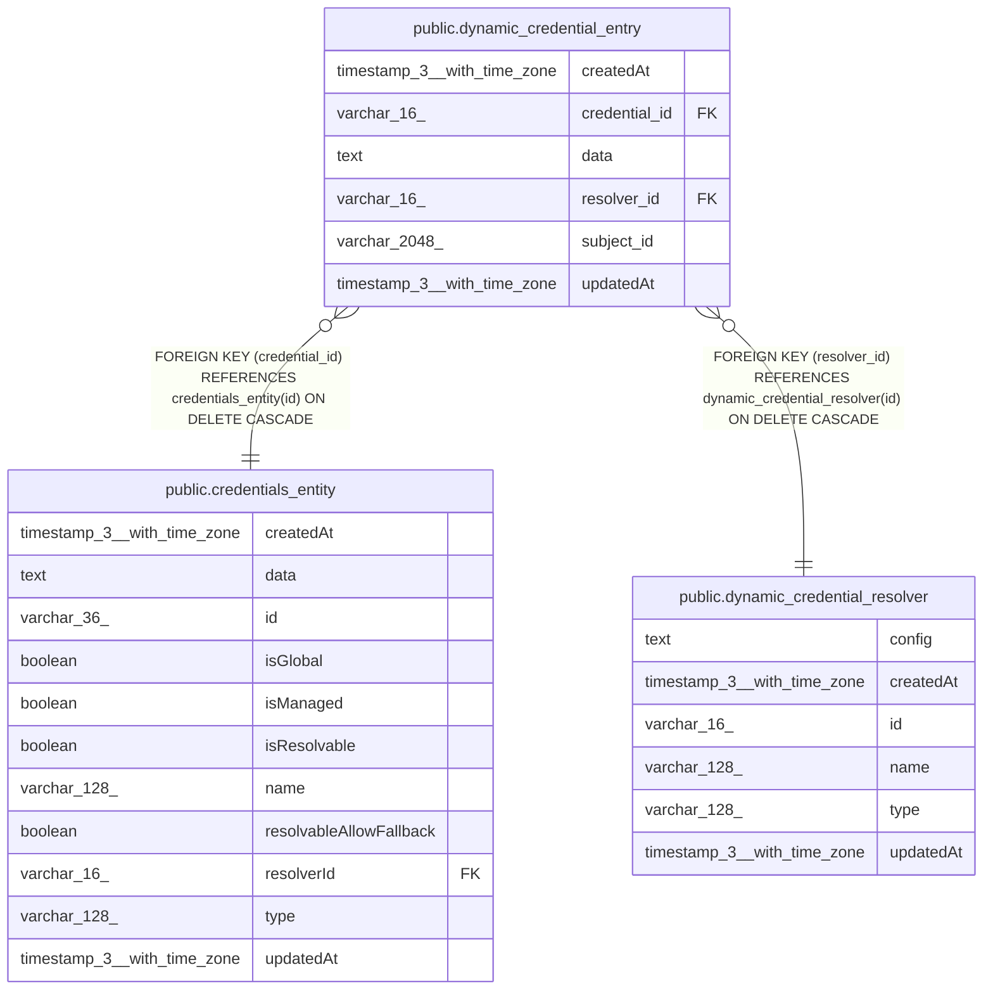

# public.dynamic_credential_entry

## Columns

| Name | Type | Default | Nullable | Children | Parents | Comment |
| ---- | ---- | ------- | -------- | -------- | ------- | ------- |
| createdAt | timestamp(3) with time zone | CURRENT_TIMESTAMP(3) | false |  |  |  |
| credential_id | varchar(16) |  | false |  | [public.credentials_entity](public.credentials_entity.md) |  |
| data | text |  | false |  |  |  |
| resolver_id | varchar(16) |  | false |  | [public.dynamic_credential_resolver](public.dynamic_credential_resolver.md) |  |
| subject_id | varchar(2048) |  | false |  |  |  |
| updatedAt | timestamp(3) with time zone | CURRENT_TIMESTAMP(3) | false |  |  |  |

## Constraints

| Name | Type | Definition |
| ---- | ---- | ---------- |
| FK_a6d1dd080958304a47a02952aab | FOREIGN KEY | FOREIGN KEY (credential_id) REFERENCES credentials_entity(id) ON DELETE CASCADE |
| FK_d61a12235d268a49af6a3c09c13 | FOREIGN KEY | FOREIGN KEY (resolver_id) REFERENCES dynamic_credential_resolver(id) ON DELETE CASCADE |
| PK_5135ffcabecad4727ff6b9b803d | PRIMARY KEY | PRIMARY KEY (credential_id, subject_id, resolver_id) |
| tmp_dynamic_credential_entry_createdAt_not_null | n | NOT NULL "createdAt" |
| tmp_dynamic_credential_entry_credential_id_not_null | n | NOT NULL credential_id |
| tmp_dynamic_credential_entry_data_not_null | n | NOT NULL data |
| tmp_dynamic_credential_entry_resolver_id_not_null | n | NOT NULL resolver_id |
| tmp_dynamic_credential_entry_subject_id_not_null | n | NOT NULL subject_id |
| tmp_dynamic_credential_entry_updatedAt_not_null | n | NOT NULL "updatedAt" |

## Indexes

| Name | Definition |
| ---- | ---------- |
| IDX_62476b94b56d9dc7ed9ed75d3d | CREATE INDEX "IDX_62476b94b56d9dc7ed9ed75d3d" ON public.dynamic_credential_entry USING btree (subject_id) |
| IDX_d61a12235d268a49af6a3c09c1 | CREATE INDEX "IDX_d61a12235d268a49af6a3c09c1" ON public.dynamic_credential_entry USING btree (resolver_id) |
| PK_5135ffcabecad4727ff6b9b803d | CREATE UNIQUE INDEX "PK_5135ffcabecad4727ff6b9b803d" ON public.dynamic_credential_entry USING btree (credential_id, subject_id, resolver_id) |

## Relations

---

> Generated by [tbls](https://github.com/k1LoW/tbls)
