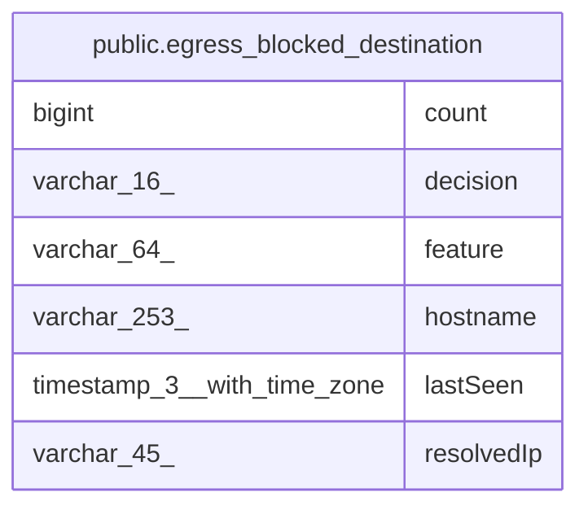

# public.egress_blocked_destination

## Columns

| Name | Type | Default | Nullable | Children | Parents | Comment |
| ---- | ---- | ------- | -------- | -------- | ------- | ------- |
| count | bigint | 0 | false |  |  |  |
| decision | varchar(16) |  | false |  |  |  |
| feature | varchar(64) |  | false |  |  |  |
| hostname | varchar(253) |  | false |  |  |  |
| lastSeen | timestamp(3) with time zone |  | false |  |  |  |
| resolvedIp | varchar(45) |  | false |  |  |  |

## Constraints

| Name | Type | Definition |
| ---- | ---- | ---------- |
| PK_c4712f9cf1014837ef4985d4947 | PRIMARY KEY | PRIMARY KEY (hostname, "resolvedIp", feature, decision) |
| egress_blocked_destination_count_not_null | n | NOT NULL count |
| egress_blocked_destination_decision_not_null | n | NOT NULL decision |
| egress_blocked_destination_feature_not_null | n | NOT NULL feature |
| egress_blocked_destination_hostname_not_null | n | NOT NULL hostname |
| egress_blocked_destination_lastSeen_not_null | n | NOT NULL "lastSeen" |
| egress_blocked_destination_resolvedIp_not_null | n | NOT NULL "resolvedIp" |

## Indexes

| Name | Definition |
| ---- | ---------- |
| IDX_cdc8dd8ad6a79a437850a6045a | CREATE INDEX "IDX_cdc8dd8ad6a79a437850a6045a" ON public.egress_blocked_destination USING btree ("lastSeen") |
| PK_c4712f9cf1014837ef4985d4947 | CREATE UNIQUE INDEX "PK_c4712f9cf1014837ef4985d4947" ON public.egress_blocked_destination USING btree (hostname, "resolvedIp", feature, decision) |

## Relations

---

> Generated by [tbls](https://github.com/k1LoW/tbls)
