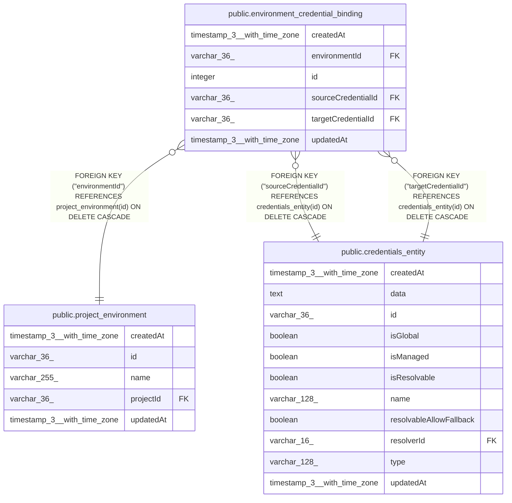

# public.environment_credential_binding

## Columns

| Name | Type | Default | Nullable | Children | Parents | Comment |
| ---- | ---- | ------- | -------- | -------- | ------- | ------- |
| createdAt | timestamp(3) with time zone | CURRENT_TIMESTAMP(3) | false |  |  |  |
| environmentId | varchar(36) |  | false |  | [public.project_environment](public.project_environment.md) |  |
| id | integer | nextval('environment_credential_binding_id_seq'::regclass) | false |  |  |  |
| sourceCredentialId | varchar(36) |  | false |  | [public.credentials_entity](public.credentials_entity.md) |  |
| targetCredentialId | varchar(36) |  | false |  | [public.credentials_entity](public.credentials_entity.md) |  |
| updatedAt | timestamp(3) with time zone | CURRENT_TIMESTAMP(3) | false |  |  |  |

## Constraints

| Name | Type | Definition |
| ---- | ---- | ---------- |
| FK_0a175417bde5f5254b8c12cc242 | FOREIGN KEY | FOREIGN KEY ("targetCredentialId") REFERENCES credentials_entity(id) ON DELETE CASCADE |
| FK_0a768f1d90ef82cf3678e313759 | FOREIGN KEY | FOREIGN KEY ("environmentId") REFERENCES project_environment(id) ON DELETE CASCADE |
| FK_2d49f32b49d32d94684cd6a05c3 | FOREIGN KEY | FOREIGN KEY ("sourceCredentialId") REFERENCES credentials_entity(id) ON DELETE CASCADE |
| PK_88ccc069e07fe20a0cd57c80576 | PRIMARY KEY | PRIMARY KEY (id) |
| environment_credential_binding_createdAt_not_null | n | NOT NULL "createdAt" |
| environment_credential_binding_environmentId_not_null | n | NOT NULL "environmentId" |
| environment_credential_binding_id_not_null | n | NOT NULL id |
| environment_credential_binding_sourceCredentialId_not_null | n | NOT NULL "sourceCredentialId" |
| environment_credential_binding_targetCredentialId_not_null | n | NOT NULL "targetCredentialId" |
| environment_credential_binding_updatedAt_not_null | n | NOT NULL "updatedAt" |

## Indexes

| Name | Definition |
| ---- | ---------- |
| IDX_0a768f1d90ef82cf3678e31375 | CREATE INDEX "IDX_0a768f1d90ef82cf3678e31375" ON public.environment_credential_binding USING btree ("environmentId") |
| IDX_0b7ddcf4ee25bb1f126e3186a2 | CREATE UNIQUE INDEX "IDX_0b7ddcf4ee25bb1f126e3186a2" ON public.environment_credential_binding USING btree ("environmentId", "sourceCredentialId") |
| PK_88ccc069e07fe20a0cd57c80576 | CREATE UNIQUE INDEX "PK_88ccc069e07fe20a0cd57c80576" ON public.environment_credential_binding USING btree (id) |

## Relations

---

> Generated by [tbls](https://github.com/k1LoW/tbls)
