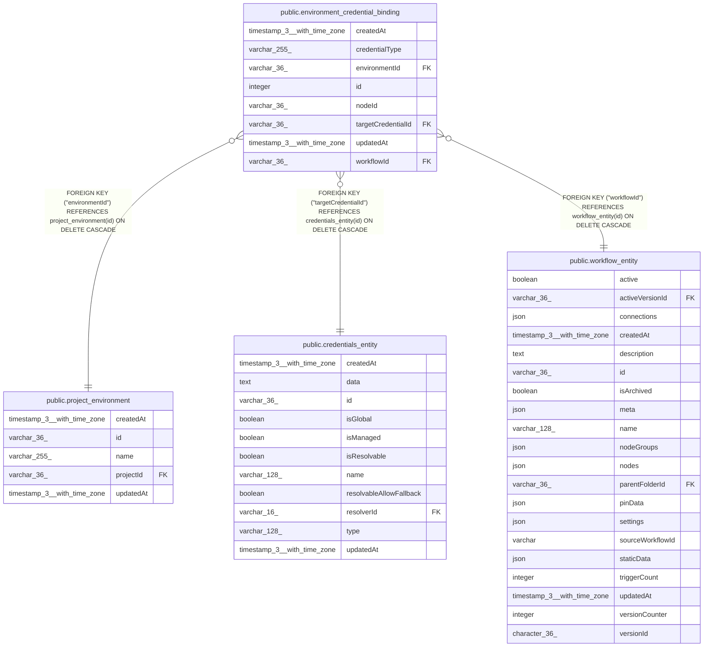

# public.environment_credential_binding

## Columns

| Name | Type | Default | Nullable | Children | Parents | Comment |
| ---- | ---- | ------- | -------- | -------- | ------- | ------- |
| createdAt | timestamp(3) with time zone | CURRENT_TIMESTAMP(3) | false |  |  |  |
| credentialType | varchar(255) |  | false |  |  |  |
| environmentId | varchar(36) |  | false |  | [public.project_environment](public.project_environment.md) |  |
| id | integer | nextval('environment_credential_binding_id_seq'::regclass) | false |  |  |  |
| nodeId | varchar(36) |  | false |  |  |  |
| targetCredentialId | varchar(36) |  | false |  | [public.credentials_entity](public.credentials_entity.md) |  |
| updatedAt | timestamp(3) with time zone | CURRENT_TIMESTAMP(3) | false |  |  |  |
| workflowId | varchar(36) |  | false |  | [public.workflow_entity](public.workflow_entity.md) |  |

## Constraints

| Name | Type | Definition |
| ---- | ---- | ---------- |
| FK_0a175417bde5f5254b8c12cc242 | FOREIGN KEY | FOREIGN KEY ("targetCredentialId") REFERENCES credentials_entity(id) ON DELETE CASCADE |
| FK_0a768f1d90ef82cf3678e313759 | FOREIGN KEY | FOREIGN KEY ("environmentId") REFERENCES project_environment(id) ON DELETE CASCADE |
| FK_8a3cd22704215a2ee7307b83ec9 | FOREIGN KEY | FOREIGN KEY ("workflowId") REFERENCES workflow_entity(id) ON DELETE CASCADE |
| PK_88ccc069e07fe20a0cd57c80576 | PRIMARY KEY | PRIMARY KEY (id) |
| environment_credential_binding_createdAt_not_null | n | NOT NULL "createdAt" |
| environment_credential_binding_credentialType_not_null | n | NOT NULL "credentialType" |
| environment_credential_binding_environmentId_not_null | n | NOT NULL "environmentId" |
| environment_credential_binding_id_not_null | n | NOT NULL id |
| environment_credential_binding_nodeId_not_null | n | NOT NULL "nodeId" |
| environment_credential_binding_targetCredentialId_not_null | n | NOT NULL "targetCredentialId" |
| environment_credential_binding_updatedAt_not_null | n | NOT NULL "updatedAt" |
| environment_credential_binding_workflowId_not_null | n | NOT NULL "workflowId" |

## Indexes

| Name | Definition |
| ---- | ---------- |
| IDX_c59dc9433e72e6ea7533b735c0 | CREATE UNIQUE INDEX "IDX_c59dc9433e72e6ea7533b735c0" ON public.environment_credential_binding USING btree ("workflowId", "environmentId", "nodeId", "credentialType") |
| IDX_e6dcfc0dc8aef030779068ea44 | CREATE INDEX "IDX_e6dcfc0dc8aef030779068ea44" ON public.environment_credential_binding USING btree ("workflowId", "environmentId") |
| PK_88ccc069e07fe20a0cd57c80576 | CREATE UNIQUE INDEX "PK_88ccc069e07fe20a0cd57c80576" ON public.environment_credential_binding USING btree (id) |

## Relations

---

> Generated by [tbls](https://github.com/k1LoW/tbls)
