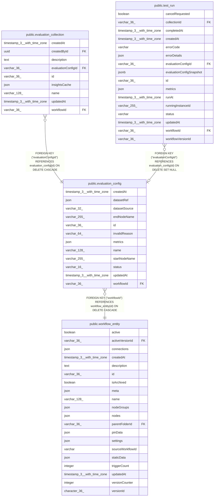

# public.evaluation_config

## Columns

| Name | Type | Default | Nullable | Children | Parents | Comment |
| ---- | ---- | ------- | -------- | -------- | ------- | ------- |
| createdAt | timestamp(3) with time zone | CURRENT_TIMESTAMP(3) | false |  |  |  |
| datasetRef | json |  | false |  |  |  |
| datasetSource | varchar(32) |  | false |  |  |  |
| endNodeName | varchar(255) |  | false |  |  |  |
| id | varchar(36) |  | false | [public.evaluation_collection](public.evaluation_collection.md) [public.test_run](public.test_run.md) |  |  |
| invalidReason | varchar(64) |  | true |  |  |  |
| metrics | json |  | false |  |  |  |
| name | varchar(128) |  | false |  |  |  |
| startNodeName | varchar(255) |  | false |  |  |  |
| status | varchar(16) | 'valid'::character varying | false |  |  |  |
| updatedAt | timestamp(3) with time zone | CURRENT_TIMESTAMP(3) | false |  |  |  |
| workflowId | varchar(36) |  | false |  | [public.workflow_entity](public.workflow_entity.md) |  |

## Constraints

| Name | Type | Definition |
| ---- | ---- | ---------- |
| FK_fd7542bb123074760285dc1bbf3 | FOREIGN KEY | FOREIGN KEY ("workflowId") REFERENCES workflow_entity(id) ON DELETE CASCADE |
| PK_59c14dccf8989df94070c2dcfda | PRIMARY KEY | PRIMARY KEY (id) |
| UQ_3c3c99a712e971835c52292e44c | UNIQUE | UNIQUE ("workflowId", name) |
| evaluation_config_createdAt_not_null | n | NOT NULL "createdAt" |
| evaluation_config_datasetRef_not_null | n | NOT NULL "datasetRef" |
| evaluation_config_datasetSource_not_null | n | NOT NULL "datasetSource" |
| evaluation_config_endNodeName_not_null | n | NOT NULL "endNodeName" |
| evaluation_config_id_not_null | n | NOT NULL id |
| evaluation_config_metrics_not_null | n | NOT NULL metrics |
| evaluation_config_name_not_null | n | NOT NULL name |
| evaluation_config_startNodeName_not_null | n | NOT NULL "startNodeName" |
| evaluation_config_status_not_null | n | NOT NULL status |
| evaluation_config_updatedAt_not_null | n | NOT NULL "updatedAt" |
| evaluation_config_workflowId_not_null | n | NOT NULL "workflowId" |

## Indexes

| Name | Definition |
| ---- | ---------- |
| IDX_fd7542bb123074760285dc1bbf | CREATE INDEX "IDX_fd7542bb123074760285dc1bbf" ON public.evaluation_config USING btree ("workflowId") |
| PK_59c14dccf8989df94070c2dcfda | CREATE UNIQUE INDEX "PK_59c14dccf8989df94070c2dcfda" ON public.evaluation_config USING btree (id) |
| UQ_3c3c99a712e971835c52292e44c | CREATE UNIQUE INDEX "UQ_3c3c99a712e971835c52292e44c" ON public.evaluation_config USING btree ("workflowId", name) |

## Relations

---

> Generated by [tbls](https://github.com/k1LoW/tbls)
