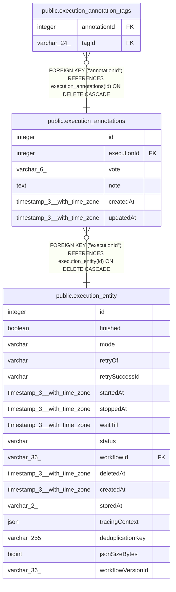

# public.execution_annotations

## Columns

| Name | Type | Default | Nullable | Children | Parents | Comment |
| ---- | ---- | ------- | -------- | -------- | ------- | ------- |
| id | integer | nextval('execution_annotations_id_seq'::regclass) | false | [public.execution_annotation_tags](public.execution_annotation_tags.md) |  |  |
| executionId | integer |  | false |  | [public.execution_entity](public.execution_entity.md) |  |
| vote | varchar(6) |  | true |  |  |  |
| note | text |  | true |  |  |  |
| createdAt | timestamp(3) with time zone | CURRENT_TIMESTAMP(3) | false |  |  |  |
| updatedAt | timestamp(3) with time zone | CURRENT_TIMESTAMP(3) | false |  |  |  |

## Constraints

| Name | Type | Definition |
| ---- | ---- | ---------- |
| execution_annotations_createdAt_not_null | n | NOT NULL "createdAt" |
| execution_annotations_executionId_not_null | n | NOT NULL "executionId" |
| execution_annotations_id_not_null | n | NOT NULL id |
| execution_annotations_updatedAt_not_null | n | NOT NULL "updatedAt" |
| FK_97f863fa83c4786f19565084960 | FOREIGN KEY | FOREIGN KEY ("executionId") REFERENCES execution_entity(id) ON DELETE CASCADE |
| PK_7afcf93ffa20c4252869a7c6a23 | PRIMARY KEY | PRIMARY KEY (id) |

## Indexes

| Name | Definition |
| ---- | ---------- |
| PK_7afcf93ffa20c4252869a7c6a23 | CREATE UNIQUE INDEX "PK_7afcf93ffa20c4252869a7c6a23" ON public.execution_annotations USING btree (id) |
| IDX_97f863fa83c4786f1956508496 | CREATE UNIQUE INDEX "IDX_97f863fa83c4786f1956508496" ON public.execution_annotations USING btree ("executionId") |

## Relations

---

> Generated by [tbls](https://github.com/k1LoW/tbls)
