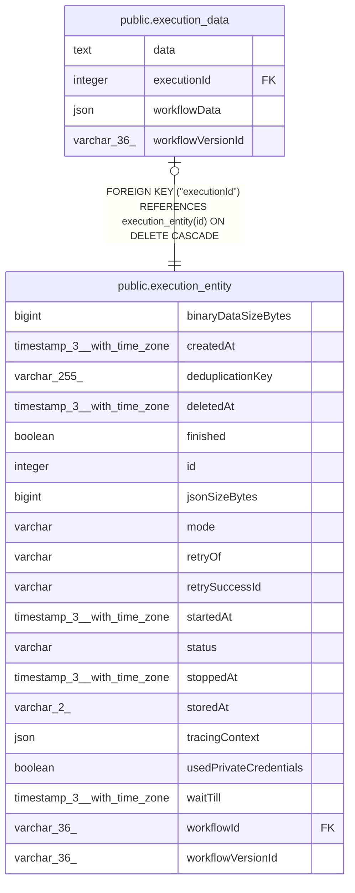

# public.execution_data

## Columns

| Name | Type | Default | Nullable | Children | Parents | Comment |
| ---- | ---- | ------- | -------- | -------- | ------- | ------- |
| data | text |  | false |  |  |  |
| executionId | integer |  | false |  | [public.execution_entity](public.execution_entity.md) |  |
| workflowData | json |  | false |  |  |  |
| workflowVersionId | varchar(36) |  | true |  |  |  |

## Constraints

| Name | Type | Definition |
| ---- | ---- | ---------- |
| execution_data_data_not_null | n | NOT NULL data |
| execution_data_executionId_not_null | n | NOT NULL "executionId" |
| execution_data_fk | FOREIGN KEY | FOREIGN KEY ("executionId") REFERENCES execution_entity(id) ON DELETE CASCADE |
| execution_data_pkey | PRIMARY KEY | PRIMARY KEY ("executionId") |
| execution_data_workflowData_not_null | n | NOT NULL "workflowData" |

## Indexes

| Name | Definition |
| ---- | ---------- |
| execution_data_pkey | CREATE UNIQUE INDEX execution_data_pkey ON public.execution_data USING btree ("executionId") |

## Relations

---

> Generated by [tbls](https://github.com/k1LoW/tbls)
