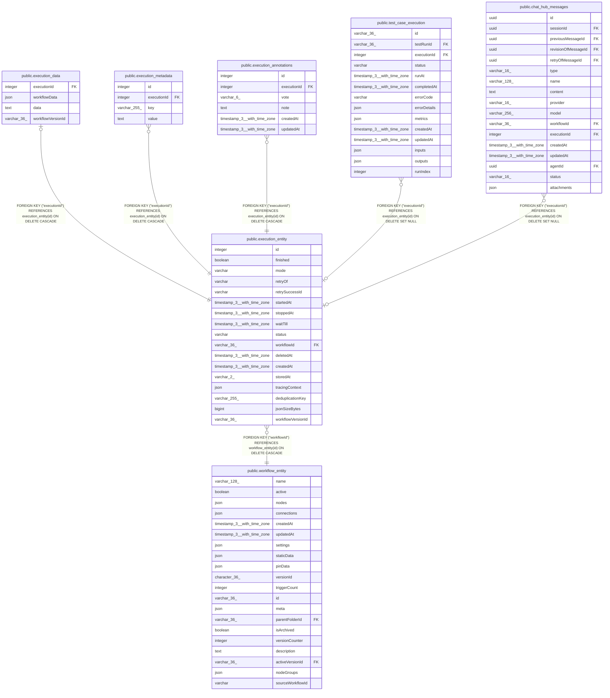

# public.execution_entity

## Columns

| Name | Type | Default | Nullable | Children | Parents | Comment |
| ---- | ---- | ------- | -------- | -------- | ------- | ------- |
| id | integer | nextval('execution_entity_id_seq'::regclass) | false | [public.execution_data](public.execution_data.md) [public.execution_metadata](public.execution_metadata.md) [public.execution_annotations](public.execution_annotations.md) [public.test_case_execution](public.test_case_execution.md) [public.chat_hub_messages](public.chat_hub_messages.md) |  |  |
| finished | boolean |  | false |  |  |  |
| mode | varchar |  | false |  |  |  |
| retryOf | varchar |  | true |  |  |  |
| retrySuccessId | varchar |  | true |  |  |  |
| startedAt | timestamp(3) with time zone |  | true |  |  |  |
| stoppedAt | timestamp(3) with time zone |  | true |  |  |  |
| waitTill | timestamp(3) with time zone |  | true |  |  |  |
| status | varchar |  | false |  |  |  |
| workflowId | varchar(36) |  | false |  | [public.workflow_entity](public.workflow_entity.md) |  |
| deletedAt | timestamp(3) with time zone |  | true |  |  |  |
| createdAt | timestamp(3) with time zone | CURRENT_TIMESTAMP(3) | false |  |  |  |
| storedAt | varchar(2) | 'db'::character varying | false |  |  |  |
| tracingContext | json |  | true |  |  |  |
| deduplicationKey | varchar(255) |  | true |  |  |  |
| jsonSizeBytes | bigint | 0 | false |  |  | Byte size of the JSON execution data bundle (run data, workflow snapshot, version id); excludes binary data. 0 means unknown. |
| workflowVersionId | varchar(36) | NULL::character varying | true |  |  | Version id of the workflow run by this execution; denormalized from the data bundle. |

## Constraints

| Name | Type | Definition |
| ---- | ---- | ---------- |
| execution_entity_createdAt_not_null | n | NOT NULL "createdAt" |
| execution_entity_finished_not_null | n | NOT NULL finished |
| execution_entity_id_not_null | n | NOT NULL id |
| execution_entity_jsonSizeBytes_not_null | n | NOT NULL "jsonSizeBytes" |
| execution_entity_mode_not_null | n | NOT NULL mode |
| execution_entity_status_not_null | n | NOT NULL status |
| execution_entity_storedAt_check | CHECK | CHECK ((("storedAt")::text = ANY ((ARRAY['db'::character varying, 'fs'::character varying, 's3'::character varying])::text[]))) |
| execution_entity_storedAt_not_null | n | NOT NULL "storedAt" |
| execution_entity_workflowId_not_null | n | NOT NULL "workflowId" |
| pk_e3e63bbf986767844bbe1166d4e | PRIMARY KEY | PRIMARY KEY (id) |
| fk_execution_entity_workflow_id | FOREIGN KEY | FOREIGN KEY ("workflowId") REFERENCES workflow_entity(id) ON DELETE CASCADE |

## Indexes

| Name | Definition |
| ---- | ---------- |
| pk_e3e63bbf986767844bbe1166d4e | CREATE UNIQUE INDEX pk_e3e63bbf986767844bbe1166d4e ON public.execution_entity USING btree (id) |
| IDX_execution_entity_deletedAt | CREATE INDEX "IDX_execution_entity_deletedAt" ON public.execution_entity USING btree ("deletedAt") |
| idx_execution_entity_workflow_id_started_at | CREATE INDEX idx_execution_entity_workflow_id_started_at ON public.execution_entity USING btree ("workflowId", "startedAt") WHERE (("startedAt" IS NOT NULL) AND ("deletedAt" IS NULL)) |
| idx_execution_entity_wait_till_status_deleted_at | CREATE INDEX idx_execution_entity_wait_till_status_deleted_at ON public.execution_entity USING btree ("waitTill", status, "deletedAt") WHERE (("waitTill" IS NOT NULL) AND ("deletedAt" IS NULL)) |
| idx_execution_entity_stopped_at_status_deleted_at | CREATE INDEX idx_execution_entity_stopped_at_status_deleted_at ON public.execution_entity USING btree ("stoppedAt", status, "deletedAt") WHERE (("stoppedAt" IS NOT NULL) AND ("deletedAt" IS NULL)) |
| IDX_execution_entity_deduplicationKey | CREATE UNIQUE INDEX "IDX_execution_entity_deduplicationKey" ON public.execution_entity USING btree ("deduplicationKey") WHERE ("deduplicationKey" IS NOT NULL) |
| IDX_execution_entity_workflowId_status_id | CREATE INDEX "IDX_execution_entity_workflowId_status_id" ON public.execution_entity USING btree ("workflowId", status, id) WHERE ("deletedAt" IS NULL) |

## Relations

---

> Generated by [tbls](https://github.com/k1LoW/tbls)
