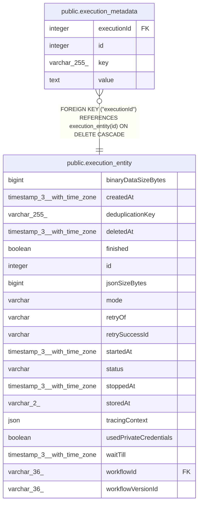

# public.execution_metadata

## Columns

| Name | Type | Default | Nullable | Children | Parents | Comment |
| ---- | ---- | ------- | -------- | -------- | ------- | ------- |
| executionId | integer |  | false |  | [public.execution_entity](public.execution_entity.md) |  |
| id | integer | nextval('execution_metadata_temp_id_seq'::regclass) | false |  |  |  |
| key | varchar(255) |  | false |  |  |  |
| value | text |  | false |  |  |  |

## Constraints

| Name | Type | Definition |
| ---- | ---- | ---------- |
| FK_31d0b4c93fb85ced26f6005cda3 | FOREIGN KEY | FOREIGN KEY ("executionId") REFERENCES execution_entity(id) ON DELETE CASCADE |
| PK_17a0b6284f8d626aae88e1c16e4 | PRIMARY KEY | PRIMARY KEY (id) |
| execution_metadata_temp_executionId_not_null | n | NOT NULL "executionId" |
| execution_metadata_temp_id_not_null | n | NOT NULL id |
| execution_metadata_temp_key_not_null | n | NOT NULL key |
| execution_metadata_temp_value_not_null | n | NOT NULL value |

## Indexes

| Name | Definition |
| ---- | ---------- |
| IDX_cec8eea3bf49551482ccb4933e | CREATE UNIQUE INDEX "IDX_cec8eea3bf49551482ccb4933e" ON public.execution_metadata USING btree ("executionId", key) |
| PK_17a0b6284f8d626aae88e1c16e4 | CREATE UNIQUE INDEX "PK_17a0b6284f8d626aae88e1c16e4" ON public.execution_metadata USING btree (id) |

## Relations

---

> Generated by [tbls](https://github.com/k1LoW/tbls)
