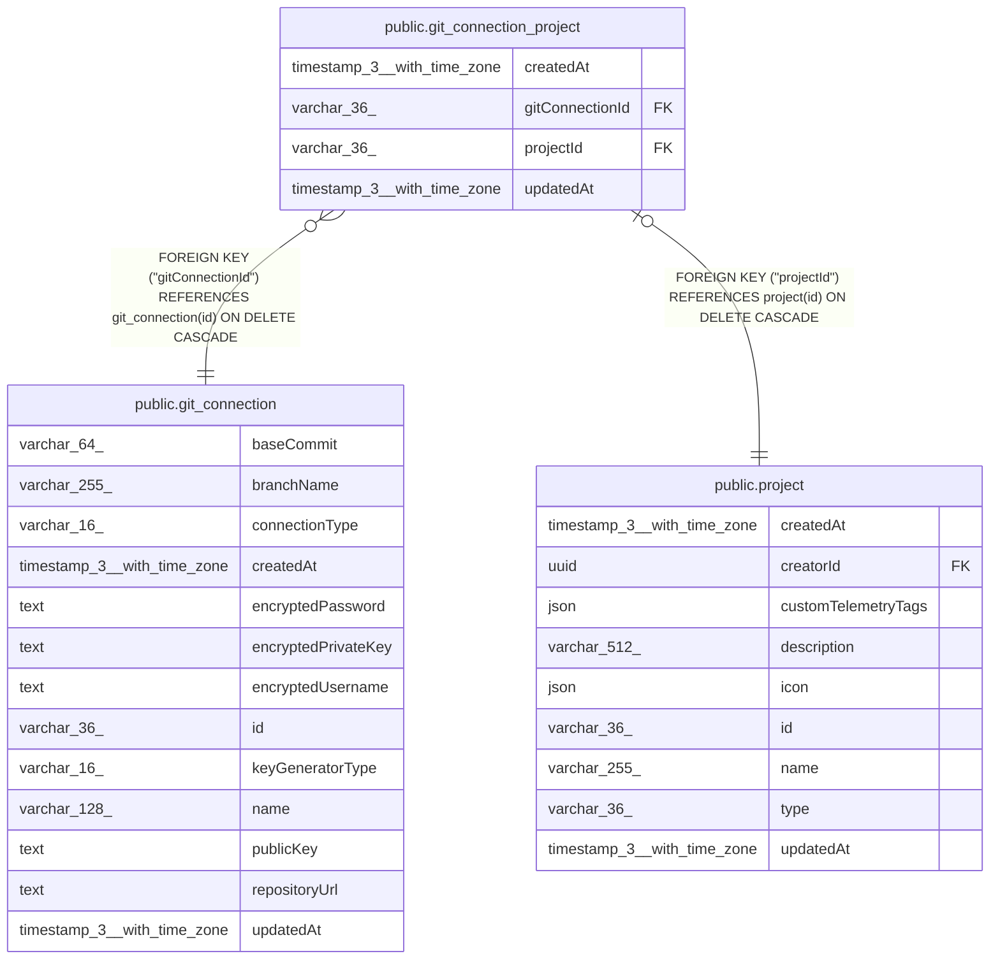

# public.git_connection_project

## Columns

| Name | Type | Default | Nullable | Children | Parents | Comment |
| ---- | ---- | ------- | -------- | -------- | ------- | ------- |
| createdAt | timestamp(3) with time zone | CURRENT_TIMESTAMP(3) | false |  |  |  |
| gitConnectionId | varchar(36) |  | false |  | [public.git_connection](public.git_connection.md) |  |
| projectId | varchar(36) |  | false |  | [public.project](public.project.md) |  |
| updatedAt | timestamp(3) with time zone | CURRENT_TIMESTAMP(3) | false |  |  |  |

## Constraints

| Name | Type | Definition |
| ---- | ---- | ---------- |
| FK_12a7fe192a1ee1d933e712e6b1c | FOREIGN KEY | FOREIGN KEY ("gitConnectionId") REFERENCES git_connection(id) ON DELETE CASCADE |
| FK_5affe1c6075bd7ac20297b7947c | FOREIGN KEY | FOREIGN KEY ("projectId") REFERENCES project(id) ON DELETE CASCADE |
| PK_5affe1c6075bd7ac20297b7947c | PRIMARY KEY | PRIMARY KEY ("projectId") |
| git_connection_project_createdAt_not_null | n | NOT NULL "createdAt" |
| git_connection_project_gitConnectionId_not_null | n | NOT NULL "gitConnectionId" |
| git_connection_project_projectId_not_null | n | NOT NULL "projectId" |
| git_connection_project_updatedAt_not_null | n | NOT NULL "updatedAt" |

## Indexes

| Name | Definition |
| ---- | ---------- |
| IDX_12a7fe192a1ee1d933e712e6b1 | CREATE INDEX "IDX_12a7fe192a1ee1d933e712e6b1" ON public.git_connection_project USING btree ("gitConnectionId") |
| PK_5affe1c6075bd7ac20297b7947c | CREATE UNIQUE INDEX "PK_5affe1c6075bd7ac20297b7947c" ON public.git_connection_project USING btree ("projectId") |

## Relations

---

> Generated by [tbls](https://github.com/k1LoW/tbls)
