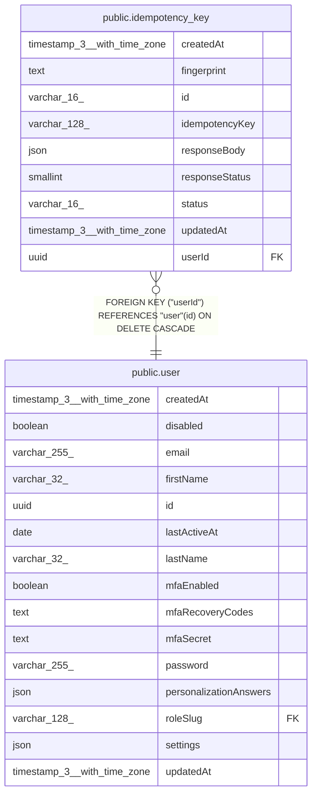

# public.idempotency_key

## Columns

| Name | Type | Default | Nullable | Children | Parents | Comment |
| ---- | ---- | ------- | -------- | -------- | ------- | ------- |
| createdAt | timestamp(3) with time zone | CURRENT_TIMESTAMP(3) | false |  |  |  |
| fingerprint | text |  | false |  |  | Hash of the request method, path, and body |
| id | varchar(16) |  | false |  |  | Application-generated n8n nano ID |
| idempotencyKey | varchar(128) |  | false |  |  | Client Idempotency-Key header. Opaque ASCII, length 1 to 128 |
| responseBody | json |  | true |  |  | Stored response body. NULL while status is processing |
| responseStatus | smallint |  | true |  |  | HTTP status of the stored response. NULL while processing, required once completed |
| status | varchar(16) | 'processing'::character varying | false |  |  | processing while the handler runs. completed after the response is stored |
| updatedAt | timestamp(3) with time zone | CURRENT_TIMESTAMP(3) | false |  |  |  |
| userId | uuid |  | false |  | [public.user](public.user.md) |  |

## Constraints

| Name | Type | Definition |
| ---- | ---- | ---------- |
| CHK_idempotency_key_responseStatus | CHECK | CHECK (((((status)::text = 'processing'::text) AND ("responseStatus" IS NULL)) OR (((status)::text = 'completed'::text) AND ("responseStatus" IS NOT NULL)))) |
| CHK_idempotency_key_status | CHECK | CHECK (((status)::text = ANY ((ARRAY['processing'::character varying, 'completed'::character varying])::text[]))) |
| FK_idempotency_key_userId | FOREIGN KEY | FOREIGN KEY ("userId") REFERENCES "user"(id) ON DELETE CASCADE |
| PK_213f125e14469be304f9ff1d452 | PRIMARY KEY | PRIMARY KEY (id) |
| idempotency_key_createdAt_not_null | n | NOT NULL "createdAt" |
| idempotency_key_fingerprint_not_null | n | NOT NULL fingerprint |
| idempotency_key_id_not_null | n | NOT NULL id |
| idempotency_key_idempotencyKey_not_null | n | NOT NULL "idempotencyKey" |
| idempotency_key_status_not_null | n | NOT NULL status |
| idempotency_key_updatedAt_not_null | n | NOT NULL "updatedAt" |
| idempotency_key_userId_not_null | n | NOT NULL "userId" |

## Indexes

| Name | Definition |
| ---- | ---------- |
| IDX_25289244569e505292cde510d7 | CREATE UNIQUE INDEX "IDX_25289244569e505292cde510d7" ON public.idempotency_key USING btree ("userId", "idempotencyKey") |
| IDX_38536b1937c55d305af4d69a97 | CREATE INDEX "IDX_38536b1937c55d305af4d69a97" ON public.idempotency_key USING btree ("createdAt") |
| PK_213f125e14469be304f9ff1d452 | CREATE UNIQUE INDEX "PK_213f125e14469be304f9ff1d452" ON public.idempotency_key USING btree (id) |

## Relations

---

> Generated by [tbls](https://github.com/k1LoW/tbls)
