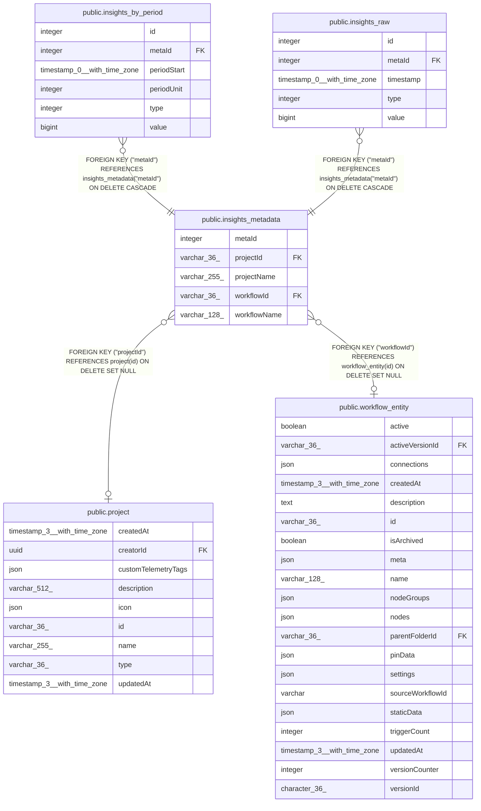

# public.insights_metadata

## Columns

| Name | Type | Default | Nullable | Children | Parents | Comment |
| ---- | ---- | ------- | -------- | -------- | ------- | ------- |
| metaId | integer |  | false | [public.insights_by_period](public.insights_by_period.md) [public.insights_raw](public.insights_raw.md) |  |  |
| projectId | varchar(36) |  | true |  | [public.project](public.project.md) |  |
| projectName | varchar(255) |  | false |  |  |  |
| workflowId | varchar(36) |  | true |  | [public.workflow_entity](public.workflow_entity.md) |  |
| workflowName | varchar(128) |  | false |  |  |  |

## Constraints

| Name | Type | Definition |
| ---- | ---- | ---------- |
| FK_1d8ab99d5861c9388d2dc1cf733 | FOREIGN KEY | FOREIGN KEY ("workflowId") REFERENCES workflow_entity(id) ON DELETE SET NULL |
| FK_2375a1eda085adb16b24615b69c | FOREIGN KEY | FOREIGN KEY ("projectId") REFERENCES project(id) ON DELETE SET NULL |
| PK_f448a94c35218b6208ce20cf5a1 | PRIMARY KEY | PRIMARY KEY ("metaId") |
| insights_metadata_metaId_not_null | n | NOT NULL "metaId" |
| insights_metadata_projectName_not_null | n | NOT NULL "projectName" |
| insights_metadata_workflowName_not_null | n | NOT NULL "workflowName" |

## Indexes

| Name | Definition |
| ---- | ---------- |
| IDX_1d8ab99d5861c9388d2dc1cf73 | CREATE UNIQUE INDEX "IDX_1d8ab99d5861c9388d2dc1cf73" ON public.insights_metadata USING btree ("workflowId") |
| PK_f448a94c35218b6208ce20cf5a1 | CREATE UNIQUE INDEX "PK_f448a94c35218b6208ce20cf5a1" ON public.insights_metadata USING btree ("metaId") |

## Relations

---

> Generated by [tbls](https://github.com/k1LoW/tbls)
