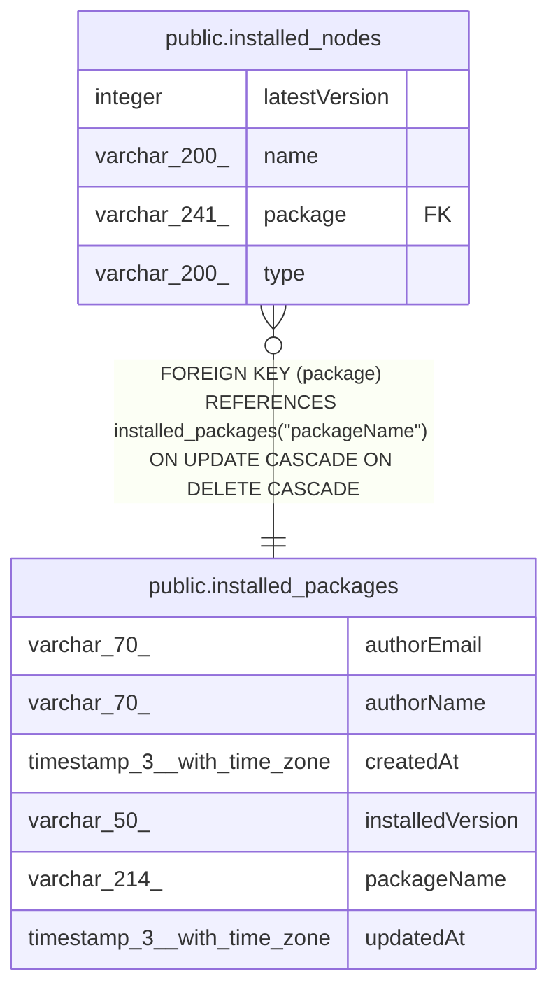

# public.installed_nodes

## Columns

| Name | Type | Default | Nullable | Children | Parents | Comment |
| ---- | ---- | ------- | -------- | -------- | ------- | ------- |
| latestVersion | integer | 1 | false |  |  |  |
| name | varchar(200) |  | false |  |  |  |
| package | varchar(241) |  | false |  | [public.installed_packages](public.installed_packages.md) |  |
| type | varchar(200) |  | false |  |  |  |

## Constraints

| Name | Type | Definition |
| ---- | ---- | ---------- |
| FK_73f857fc5dce682cef8a99c11dbddbc969618951 | FOREIGN KEY | FOREIGN KEY (package) REFERENCES installed_packages("packageName") ON UPDATE CASCADE ON DELETE CASCADE |
| PK_8ebd28194e4f792f96b5933423fc439df97d9689 | PRIMARY KEY | PRIMARY KEY (name) |
| installed_nodes_latestVersion_not_null | n | NOT NULL "latestVersion" |
| installed_nodes_name_not_null | n | NOT NULL name |
| installed_nodes_package_not_null | n | NOT NULL package |
| installed_nodes_type_not_null | n | NOT NULL type |

## Indexes

| Name | Definition |
| ---- | ---------- |
| PK_8ebd28194e4f792f96b5933423fc439df97d9689 | CREATE UNIQUE INDEX "PK_8ebd28194e4f792f96b5933423fc439df97d9689" ON public.installed_nodes USING btree (name) |

## Relations

---

> Generated by [tbls](https://github.com/k1LoW/tbls)
