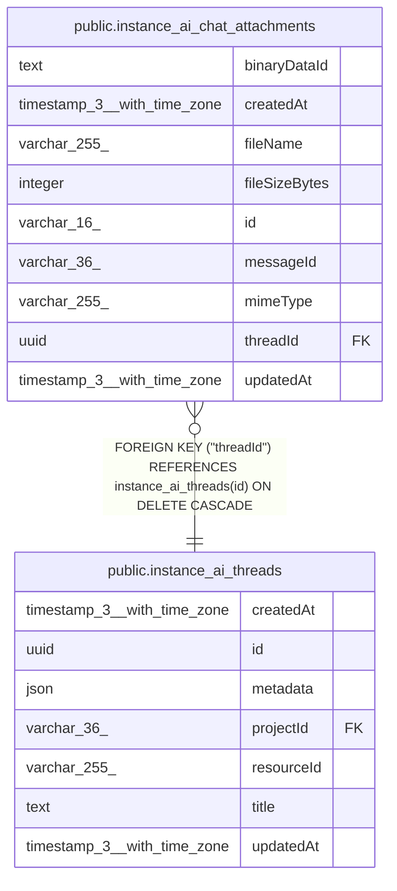

# public.instance_ai_chat_attachments

## Columns

| Name | Type | Default | Nullable | Children | Parents | Comment |
| ---- | ---- | ------- | -------- | -------- | ------- | ------- |
| binaryDataId | text |  | false |  |  | Opaque BinaryDataService reference; not an FK to binary_data |
| createdAt | timestamp(3) with time zone | CURRENT_TIMESTAMP(3) | false |  |  |  |
| fileName | varchar(255) |  | false |  |  |  |
| fileSizeBytes | integer |  | false |  |  | Uploaded file size in bytes |
| id | varchar(16) |  | false |  |  | Application-generated n8n nano ID |
| messageId | varchar(36) |  | true |  |  | User message that introduced the file, when known |
| mimeType | varchar(255) |  | false |  |  |  |
| threadId | uuid |  | false |  | [public.instance_ai_threads](public.instance_ai_threads.md) | Session the attachment belongs to |
| updatedAt | timestamp(3) with time zone | CURRENT_TIMESTAMP(3) | false |  |  |  |

## Constraints

| Name | Type | Definition |
| ---- | ---- | ---------- |
| FK_a34dafe1cb4d3bce8e4d327d43b | FOREIGN KEY | FOREIGN KEY ("threadId") REFERENCES instance_ai_threads(id) ON DELETE CASCADE |
| PK_40a9b3af46095e3e57875b65b4b | PRIMARY KEY | PRIMARY KEY (id) |
| instance_ai_chat_attachments_binaryDataId_not_null | n | NOT NULL "binaryDataId" |
| instance_ai_chat_attachments_createdAt_not_null | n | NOT NULL "createdAt" |
| instance_ai_chat_attachments_fileName_not_null | n | NOT NULL "fileName" |
| instance_ai_chat_attachments_fileSizeBytes_not_null | n | NOT NULL "fileSizeBytes" |
| instance_ai_chat_attachments_id_not_null | n | NOT NULL id |
| instance_ai_chat_attachments_mimeType_not_null | n | NOT NULL "mimeType" |
| instance_ai_chat_attachments_threadId_not_null | n | NOT NULL "threadId" |
| instance_ai_chat_attachments_updatedAt_not_null | n | NOT NULL "updatedAt" |

## Indexes

| Name | Definition |
| ---- | ---------- |
| IDX_a34dafe1cb4d3bce8e4d327d43 | CREATE INDEX "IDX_a34dafe1cb4d3bce8e4d327d43" ON public.instance_ai_chat_attachments USING btree ("threadId") |
| PK_40a9b3af46095e3e57875b65b4b | CREATE UNIQUE INDEX "PK_40a9b3af46095e3e57875b65b4b" ON public.instance_ai_chat_attachments USING btree (id) |

## Relations

---

> Generated by [tbls](https://github.com/k1LoW/tbls)
