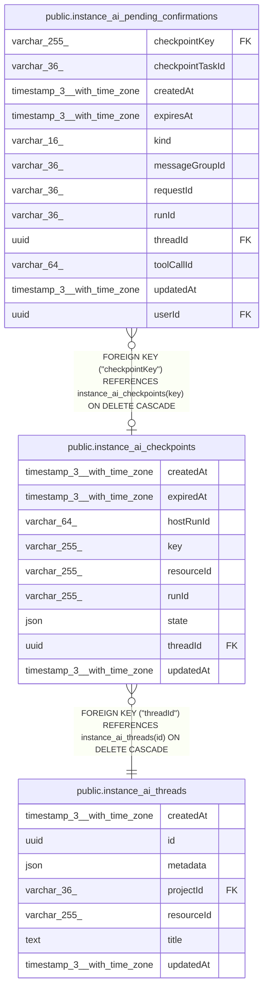

# public.instance_ai_checkpoints

## Columns

| Name | Type | Default | Nullable | Children | Parents | Comment |
| ---- | ---- | ------- | -------- | -------- | ------- | ------- |
| createdAt | timestamp(3) with time zone | CURRENT_TIMESTAMP(3) | false |  |  |  |
| expiredAt | timestamp(3) with time zone |  | true |  |  | Soft-delete timestamp: null means live; non-null marks the row as a tombstone. |
| hostRunId | varchar(64) |  | true |  |  | Host (Instance AI) run id; distinct from the agent-SDK runId parsed from the checkpoint key. |
| key | varchar(255) |  | false | [public.instance_ai_pending_confirmations](public.instance_ai_pending_confirmations.md) |  | Opaque checkpoint key from the agent runtime. |
| resourceId | varchar(255) |  | true |  |  | Resource ID recorded by the agent runtime. |
| runId | varchar(255) |  | true |  |  | Run ID parsed from the checkpoint key when available. |
| state | json |  | true |  |  | Serializable agent state snapshot stored as JSON. |
| threadId | uuid |  | false |  | [public.instance_ai_threads](public.instance_ai_threads.md) | Instance AI thread that owns the checkpoint. |
| updatedAt | timestamp(3) with time zone | CURRENT_TIMESTAMP(3) | false |  |  |  |

## Constraints

| Name | Type | Definition |
| ---- | ---- | ---------- |
| FK_2b23f3f24a70bebb990203b011e | FOREIGN KEY | FOREIGN KEY ("threadId") REFERENCES instance_ai_threads(id) ON DELETE CASCADE |
| PK_5315a45f0846d1f9d128c18a2ed | PRIMARY KEY | PRIMARY KEY (key) |
| instance_ai_checkpoints_createdAt_not_null | n | NOT NULL "createdAt" |
| instance_ai_checkpoints_key_not_null | n | NOT NULL key |
| instance_ai_checkpoints_state_tombstone_check | CHECK | CHECK (((("expiredAt" IS NOT NULL) AND (state IS NULL)) OR ("expiredAt" IS NULL))) |
| instance_ai_checkpoints_threadId_not_null | n | NOT NULL "threadId" |
| instance_ai_checkpoints_updatedAt_not_null | n | NOT NULL "updatedAt" |

## Indexes

| Name | Definition |
| ---- | ---------- |
| IDX_2b23f3f24a70bebb990203b011 | CREATE INDEX "IDX_2b23f3f24a70bebb990203b011" ON public.instance_ai_checkpoints USING btree ("threadId") |
| IDX_768189b506cc26c4fe878b87cb | CREATE INDEX "IDX_768189b506cc26c4fe878b87cb" ON public.instance_ai_checkpoints USING btree ("runId") |
| IDX_be9d0eca0b19fb93d4eb74b327 | CREATE INDEX "IDX_be9d0eca0b19fb93d4eb74b327" ON public.instance_ai_checkpoints USING btree ("resourceId") |
| PK_5315a45f0846d1f9d128c18a2ed | CREATE UNIQUE INDEX "PK_5315a45f0846d1f9d128c18a2ed" ON public.instance_ai_checkpoints USING btree (key) |

## Relations

---

> Generated by [tbls](https://github.com/k1LoW/tbls)
