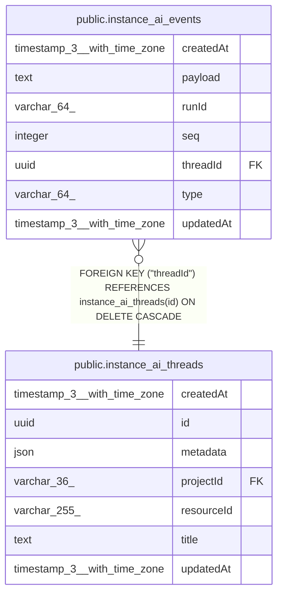

# public.instance_ai_events

## Columns

| Name | Type | Default | Nullable | Children | Parents | Comment |
| ---- | ---- | ------- | -------- | -------- | ------- | ------- |
| createdAt | timestamp(3) with time zone | CURRENT_TIMESTAMP(3) | false |  |  |  |
| payload | text |  | false |  |  | JSON of the canonical InstanceAiEvent |
| runId | varchar(64) |  | false |  |  | Run that emitted the event — opaque ID from the agent runtime |
| seq | integer |  | false |  |  | Per-thread monotonic sequence — the SSE replay cursor |
| threadId | uuid |  | false |  | [public.instance_ai_threads](public.instance_ai_threads.md) |  |
| type | varchar(64) |  | false |  |  | Event type discriminator, duplicated out of the payload |
| updatedAt | timestamp(3) with time zone | CURRENT_TIMESTAMP(3) | false |  |  |  |

## Constraints

| Name | Type | Definition |
| ---- | ---- | ---------- |
| FK_35909c5576a4a6c1d6a6fb71caa | FOREIGN KEY | FOREIGN KEY ("threadId") REFERENCES instance_ai_threads(id) ON DELETE CASCADE |
| PK_12489cd6197feeac2089acc7ef6 | PRIMARY KEY | PRIMARY KEY ("threadId", seq) |
| instance_ai_events_createdAt_not_null | n | NOT NULL "createdAt" |
| instance_ai_events_payload_not_null | n | NOT NULL payload |
| instance_ai_events_runId_not_null | n | NOT NULL "runId" |
| instance_ai_events_seq_not_null | n | NOT NULL seq |
| instance_ai_events_threadId_not_null | n | NOT NULL "threadId" |
| instance_ai_events_type_not_null | n | NOT NULL type |
| instance_ai_events_updatedAt_not_null | n | NOT NULL "updatedAt" |

## Indexes

| Name | Definition |
| ---- | ---------- |
| IDX_32cdd799675715fb1d2a8683e9 | CREATE INDEX "IDX_32cdd799675715fb1d2a8683e9" ON public.instance_ai_events USING btree ("threadId", "runId") |
| PK_12489cd6197feeac2089acc7ef6 | CREATE UNIQUE INDEX "PK_12489cd6197feeac2089acc7ef6" ON public.instance_ai_events USING btree ("threadId", seq) |

## Relations

---

> Generated by [tbls](https://github.com/k1LoW/tbls)
