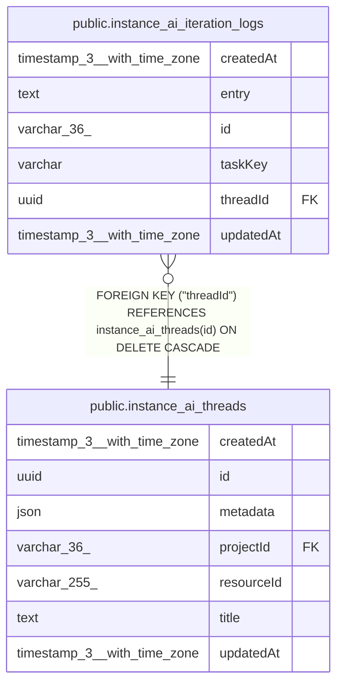

# public.instance_ai_iteration_logs

## Columns

| Name | Type | Default | Nullable | Children | Parents | Comment |
| ---- | ---- | ------- | -------- | -------- | ------- | ------- |
| createdAt | timestamp(3) with time zone | CURRENT_TIMESTAMP(3) | false |  |  |  |
| entry | text |  | false |  |  |  |
| id | varchar(36) |  | false |  |  |  |
| taskKey | varchar |  | false |  |  |  |
| threadId | uuid |  | false |  | [public.instance_ai_threads](public.instance_ai_threads.md) |  |
| updatedAt | timestamp(3) with time zone | CURRENT_TIMESTAMP(3) | false |  |  |  |

## Constraints

| Name | Type | Definition |
| ---- | ---- | ---------- |
| FK_8bfcc6c51fd3d69b1eae8aebd49 | FOREIGN KEY | FOREIGN KEY ("threadId") REFERENCES instance_ai_threads(id) ON DELETE CASCADE |
| PK_21c2b214b44bc6c34a6d3551c90 | PRIMARY KEY | PRIMARY KEY (id) |
| instance_ai_iteration_logs_createdAt_not_null | n | NOT NULL "createdAt" |
| instance_ai_iteration_logs_entry_not_null | n | NOT NULL entry |
| instance_ai_iteration_logs_id_not_null | n | NOT NULL id |
| instance_ai_iteration_logs_taskKey_not_null | n | NOT NULL "taskKey" |
| instance_ai_iteration_logs_threadId_not_null | n | NOT NULL "threadId" |
| instance_ai_iteration_logs_updatedAt_not_null | n | NOT NULL "updatedAt" |

## Indexes

| Name | Definition |
| ---- | ---------- |
| IDX_02751202c9a2ad75f2d8e14f5e | CREATE INDEX "IDX_02751202c9a2ad75f2d8e14f5e" ON public.instance_ai_iteration_logs USING btree ("threadId", "taskKey", "createdAt") |
| PK_21c2b214b44bc6c34a6d3551c90 | CREATE UNIQUE INDEX "PK_21c2b214b44bc6c34a6d3551c90" ON public.instance_ai_iteration_logs USING btree (id) |

## Relations

---

> Generated by [tbls](https://github.com/k1LoW/tbls)
