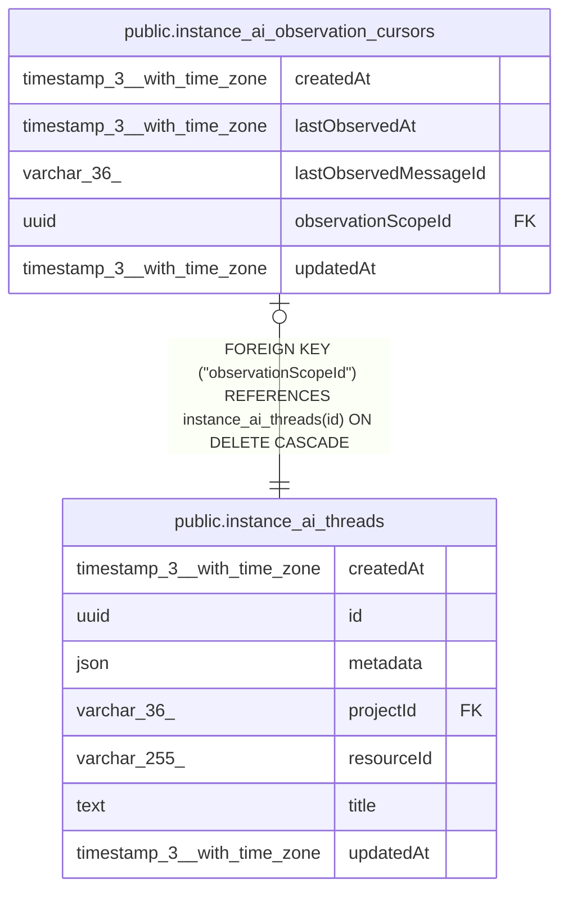

# public.instance_ai_observation_cursors

## Columns

| Name | Type | Default | Nullable | Children | Parents | Comment |
| ---- | ---- | ------- | -------- | -------- | ------- | ------- |
| createdAt | timestamp(3) with time zone | CURRENT_TIMESTAMP(3) | false |  |  |  |
| lastObservedAt | timestamp(3) with time zone |  | false |  |  |  |
| lastObservedMessageId | varchar(36) |  | false |  |  |  |
| observationScopeId | uuid |  | false |  | [public.instance_ai_threads](public.instance_ai_threads.md) | instance_ai_threads.id source stream checkpointed by this cursor |
| updatedAt | timestamp(3) with time zone | CURRENT_TIMESTAMP(3) | false |  |  |  |

## Constraints

| Name | Type | Definition |
| ---- | ---- | ---------- |
| FK_5b6319b2e9a37c1064a72428f9a | FOREIGN KEY | FOREIGN KEY ("observationScopeId") REFERENCES instance_ai_threads(id) ON DELETE CASCADE |
| PK_5b6319b2e9a37c1064a72428f9a | PRIMARY KEY | PRIMARY KEY ("observationScopeId") |
| instance_ai_observation_cursors_createdAt_not_null | n | NOT NULL "createdAt" |
| instance_ai_observation_cursors_lastObservedAt_not_null | n | NOT NULL "lastObservedAt" |
| instance_ai_observation_cursors_lastObservedMessageId_not_null | n | NOT NULL "lastObservedMessageId" |
| instance_ai_observation_cursors_observationScopeId_not_null | n | NOT NULL "observationScopeId" |
| instance_ai_observation_cursors_updatedAt_not_null | n | NOT NULL "updatedAt" |

## Indexes

| Name | Definition |
| ---- | ---------- |
| PK_5b6319b2e9a37c1064a72428f9a | CREATE UNIQUE INDEX "PK_5b6319b2e9a37c1064a72428f9a" ON public.instance_ai_observation_cursors USING btree ("observationScopeId") |

## Relations

---

> Generated by [tbls](https://github.com/k1LoW/tbls)
