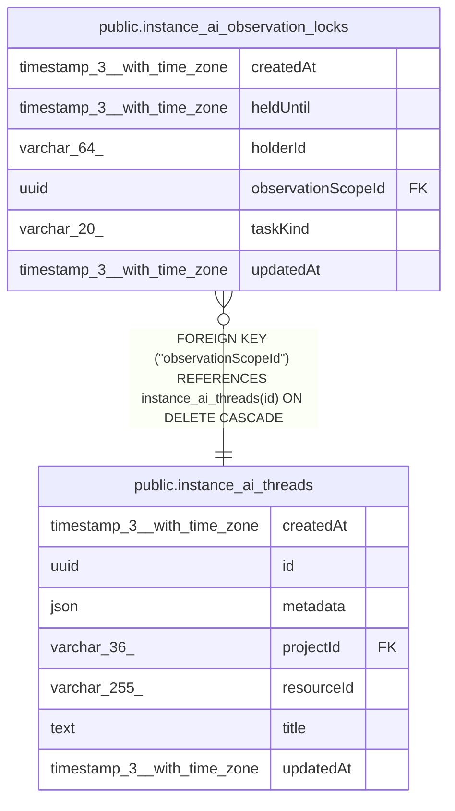

# public.instance_ai_observation_locks

## Columns

| Name | Type | Default | Nullable | Children | Parents | Comment |
| ---- | ---- | ------- | -------- | -------- | ------- | ------- |
| createdAt | timestamp(3) with time zone | CURRENT_TIMESTAMP(3) | false |  |  |  |
| heldUntil | timestamp(3) with time zone |  | false |  |  |  |
| holderId | varchar(64) |  | false |  |  | Ephemeral background-task lock owner token, not a user ID |
| observationScopeId | uuid |  | false |  | [public.instance_ai_threads](public.instance_ai_threads.md) | instance_ai_threads.id source stream locked for observation tasks |
| taskKind | varchar(20) |  | false |  |  |  |
| updatedAt | timestamp(3) with time zone | CURRENT_TIMESTAMP(3) | false |  |  |  |

## Constraints

| Name | Type | Definition |
| ---- | ---- | ---------- |
| CHK_instance_ai_observation_locks_taskKind | CHECK | CHECK ((("taskKind")::text = ANY ((ARRAY['observer'::character varying, 'reflector'::character varying])::text[]))) |
| FK_103e2e5f454860b28ea05a82c74 | FOREIGN KEY | FOREIGN KEY ("observationScopeId") REFERENCES instance_ai_threads(id) ON DELETE CASCADE |
| PK_fc491dd378b9448655c3c683f85 | PRIMARY KEY | PRIMARY KEY ("observationScopeId", "taskKind") |
| instance_ai_observation_locks_createdAt_not_null | n | NOT NULL "createdAt" |
| instance_ai_observation_locks_heldUntil_not_null | n | NOT NULL "heldUntil" |
| instance_ai_observation_locks_holderId_not_null | n | NOT NULL "holderId" |
| instance_ai_observation_locks_observationScopeId_not_null | n | NOT NULL "observationScopeId" |
| instance_ai_observation_locks_taskKind_not_null | n | NOT NULL "taskKind" |
| instance_ai_observation_locks_updatedAt_not_null | n | NOT NULL "updatedAt" |

## Indexes

| Name | Definition |
| ---- | ---------- |
| PK_fc491dd378b9448655c3c683f85 | CREATE UNIQUE INDEX "PK_fc491dd378b9448655c3c683f85" ON public.instance_ai_observation_locks USING btree ("observationScopeId", "taskKind") |

## Relations

---

> Generated by [tbls](https://github.com/k1LoW/tbls)
