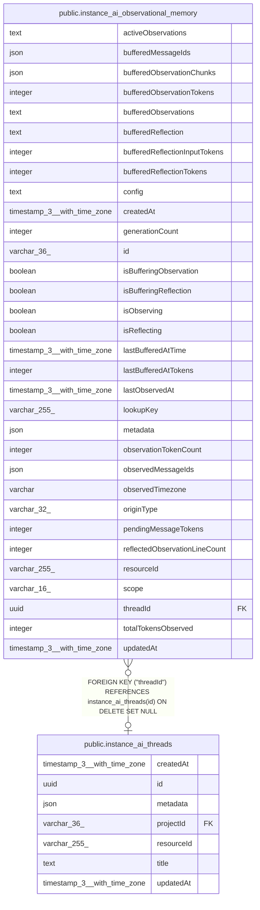

# public.instance_ai_observational_memory

## Columns

| Name | Type | Default | Nullable | Children | Parents | Comment |
| ---- | ---- | ------- | -------- | -------- | ------- | ------- |
| activeObservations | text | ''::text | false |  |  |  |
| bufferedMessageIds | json |  | true |  |  |  |
| bufferedObservationChunks | json |  | true |  |  |  |
| bufferedObservationTokens | integer |  | true |  |  |  |
| bufferedObservations | text |  | true |  |  |  |
| bufferedReflection | text |  | true |  |  |  |
| bufferedReflectionInputTokens | integer |  | true |  |  |  |
| bufferedReflectionTokens | integer |  | true |  |  |  |
| config | text |  | false |  |  |  |
| createdAt | timestamp(3) with time zone | CURRENT_TIMESTAMP(3) | false |  |  |  |
| generationCount | integer | 0 | false |  |  |  |
| id | varchar(36) |  | false |  |  |  |
| isBufferingObservation | boolean | false | false |  |  |  |
| isBufferingReflection | boolean | false | false |  |  |  |
| isObserving | boolean | false | false |  |  |  |
| isReflecting | boolean | false | false |  |  |  |
| lastBufferedAtTime | timestamp(3) with time zone |  | true |  |  |  |
| lastBufferedAtTokens | integer | 0 | false |  |  |  |
| lastObservedAt | timestamp(3) with time zone |  | true |  |  |  |
| lookupKey | varchar(255) |  | false |  |  |  |
| metadata | json |  | true |  |  |  |
| observationTokenCount | integer | 0 | false |  |  |  |
| observedMessageIds | json |  | true |  |  |  |
| observedTimezone | varchar |  | true |  |  |  |
| originType | varchar(32) |  | false |  |  |  |
| pendingMessageTokens | integer | 0 | false |  |  |  |
| reflectedObservationLineCount | integer |  | true |  |  |  |
| resourceId | varchar(255) |  | false |  |  |  |
| scope | varchar(16) |  | false |  |  |  |
| threadId | uuid |  | true |  | [public.instance_ai_threads](public.instance_ai_threads.md) |  |
| totalTokensObserved | integer | 0 | false |  |  |  |
| updatedAt | timestamp(3) with time zone | CURRENT_TIMESTAMP(3) | false |  |  |  |

## Constraints

| Name | Type | Definition |
| ---- | ---- | ---------- |
| FK_34018c303885cd37093458e6409 | FOREIGN KEY | FOREIGN KEY ("threadId") REFERENCES instance_ai_threads(id) ON DELETE SET NULL |
| PK_7192dd00cddba039bf1d3e6a098 | PRIMARY KEY | PRIMARY KEY (id) |
| instance_ai_observational_memor_isBufferingObservation_not_null | n | NOT NULL "isBufferingObservation" |
| instance_ai_observational_memory_activeObservations_not_null | n | NOT NULL "activeObservations" |
| instance_ai_observational_memory_config_not_null | n | NOT NULL config |
| instance_ai_observational_memory_createdAt_not_null | n | NOT NULL "createdAt" |
| instance_ai_observational_memory_generationCount_not_null | n | NOT NULL "generationCount" |
| instance_ai_observational_memory_id_not_null | n | NOT NULL id |
| instance_ai_observational_memory_isBufferingReflection_not_null | n | NOT NULL "isBufferingReflection" |
| instance_ai_observational_memory_isObserving_not_null | n | NOT NULL "isObserving" |
| instance_ai_observational_memory_isReflecting_not_null | n | NOT NULL "isReflecting" |
| instance_ai_observational_memory_lastBufferedAtTokens_not_null | n | NOT NULL "lastBufferedAtTokens" |
| instance_ai_observational_memory_lookupKey_not_null | n | NOT NULL "lookupKey" |
| instance_ai_observational_memory_observationTokenCount_not_null | n | NOT NULL "observationTokenCount" |
| instance_ai_observational_memory_originType_not_null | n | NOT NULL "originType" |
| instance_ai_observational_memory_pendingMessageTokens_not_null | n | NOT NULL "pendingMessageTokens" |
| instance_ai_observational_memory_resourceId_not_null | n | NOT NULL "resourceId" |
| instance_ai_observational_memory_scope_not_null | n | NOT NULL scope |
| instance_ai_observational_memory_totalTokensObserved_not_null | n | NOT NULL "totalTokensObserved" |
| instance_ai_observational_memory_updatedAt_not_null | n | NOT NULL "updatedAt" |

## Indexes

| Name | Definition |
| ---- | ---------- |
| IDX_92f13cb6bc694227e069447f7b | CREATE INDEX "IDX_92f13cb6bc694227e069447f7b" ON public.instance_ai_observational_memory USING btree ("lookupKey") |
| IDX_a680ac96aae02dc887bbaac512 | CREATE UNIQUE INDEX "IDX_a680ac96aae02dc887bbaac512" ON public.instance_ai_observational_memory USING btree (scope, "threadId", "resourceId") |
| PK_7192dd00cddba039bf1d3e6a098 | CREATE UNIQUE INDEX "PK_7192dd00cddba039bf1d3e6a098" ON public.instance_ai_observational_memory USING btree (id) |

## Relations

---

> Generated by [tbls](https://github.com/k1LoW/tbls)
