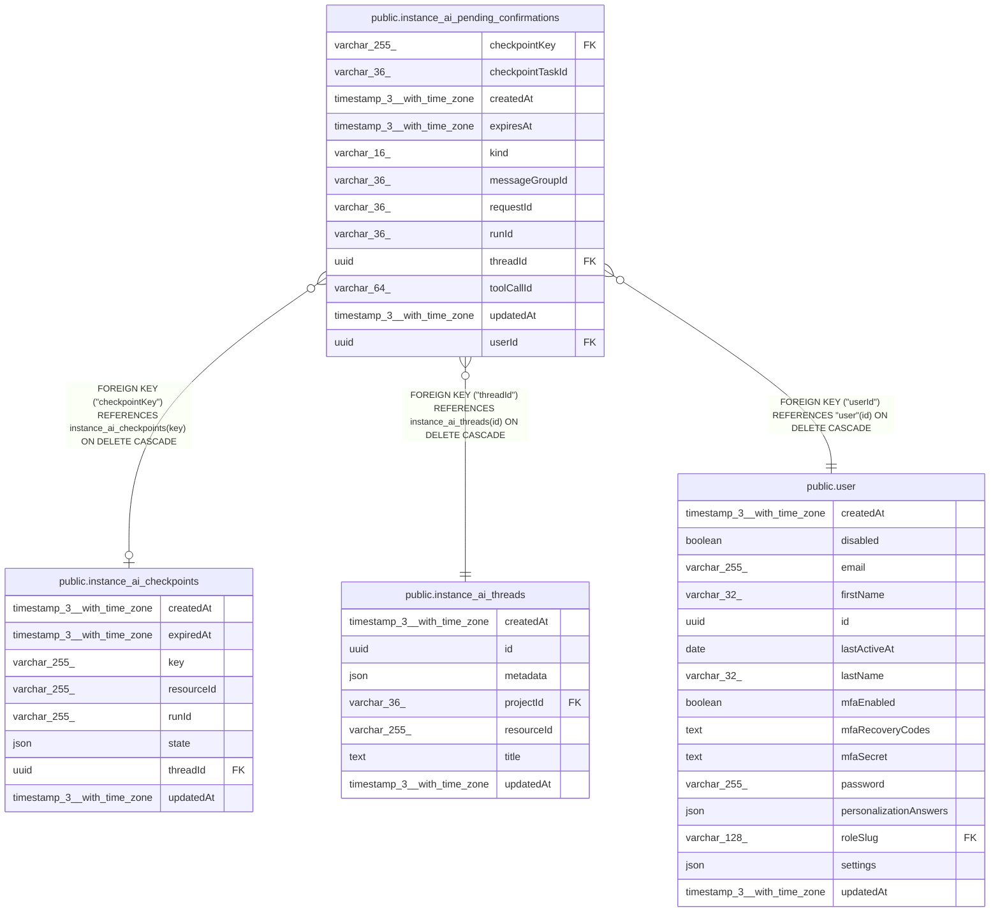

# public.instance_ai_pending_confirmations

## Columns

| Name | Type | Default | Nullable | Children | Parents | Comment |
| ---- | ---- | ------- | -------- | -------- | ------- | ------- |
| checkpointKey | varchar(255) |  | true |  | [public.instance_ai_checkpoints](public.instance_ai_checkpoints.md) | FK to instance_ai_checkpoints.key; also the SDK runId used to resume. |
| checkpointTaskId | varchar(36) |  | true |  |  | Set when the suspended run was a planned-task checkpoint follow-up. |
| createdAt | timestamp(3) with time zone | CURRENT_TIMESTAMP(3) | false |  |  |  |
| expiresAt | timestamp(3) with time zone |  | true |  |  | TTL for the leader-only sweep; null disables auto-expiry. |
| kind | varchar(16) |  | false |  |  | 'suspended' (resumable from checkpoint) or 'inline' (orchestrator-held Promise). |
| messageGroupId | varchar(36) |  | true |  |  | SSE event correlation group. |
| requestId | varchar(36) |  | false |  |  | HITL confirmation request identifier. |
| runId | varchar(36) |  | false |  |  | External run ID; reused on resume for SSE correlation. |
| threadId | uuid |  | false |  | [public.instance_ai_threads](public.instance_ai_threads.md) | Instance AI thread that owns the confirmation. |
| toolCallId | varchar(64) |  | true |  |  | Suspended tool call awaiting confirmation. |
| updatedAt | timestamp(3) with time zone | CURRENT_TIMESTAMP(3) | false |  |  |  |
| userId | uuid |  | false |  | [public.user](public.user.md) | User who is expected to confirm or cancel. |

## Constraints

| Name | Type | Definition |
| ---- | ---- | ---------- |
| CHK_instance_ai_pending_confirmations_kind | CHECK | CHECK (((kind)::text = ANY ((ARRAY['suspended'::character varying, 'inline'::character varying])::text[]))) |
| FK_0babdf6e3b897a86fe4678355eb | FOREIGN KEY | FOREIGN KEY ("checkpointKey") REFERENCES instance_ai_checkpoints(key) ON DELETE CASCADE |
| FK_ba67ee8dc311830a2eea89b6e96 | FOREIGN KEY | FOREIGN KEY ("threadId") REFERENCES instance_ai_threads(id) ON DELETE CASCADE |
| FK_df5fd25c8bbfd2b042602600d8e | FOREIGN KEY | FOREIGN KEY ("userId") REFERENCES "user"(id) ON DELETE CASCADE |
| PK_25c38179c8d45095b168adfff80 | PRIMARY KEY | PRIMARY KEY ("requestId") |
| instance_ai_pending_confirmations_createdAt_not_null | n | NOT NULL "createdAt" |
| instance_ai_pending_confirmations_kind_not_null | n | NOT NULL kind |
| instance_ai_pending_confirmations_requestId_not_null | n | NOT NULL "requestId" |
| instance_ai_pending_confirmations_runId_not_null | n | NOT NULL "runId" |
| instance_ai_pending_confirmations_threadId_not_null | n | NOT NULL "threadId" |
| instance_ai_pending_confirmations_updatedAt_not_null | n | NOT NULL "updatedAt" |
| instance_ai_pending_confirmations_userId_not_null | n | NOT NULL "userId" |

## Indexes

| Name | Definition |
| ---- | ---------- |
| IDX_0babdf6e3b897a86fe4678355e | CREATE INDEX "IDX_0babdf6e3b897a86fe4678355e" ON public.instance_ai_pending_confirmations USING btree ("checkpointKey") |
| IDX_ba67ee8dc311830a2eea89b6e9 | CREATE INDEX "IDX_ba67ee8dc311830a2eea89b6e9" ON public.instance_ai_pending_confirmations USING btree ("threadId") |
| IDX_d7a4aba7440449865e2b924377 | CREATE INDEX "IDX_d7a4aba7440449865e2b924377" ON public.instance_ai_pending_confirmations USING btree ("expiresAt") |
| IDX_df5fd25c8bbfd2b042602600d8 | CREATE INDEX "IDX_df5fd25c8bbfd2b042602600d8" ON public.instance_ai_pending_confirmations USING btree ("userId") |
| PK_25c38179c8d45095b168adfff80 | CREATE UNIQUE INDEX "PK_25c38179c8d45095b168adfff80" ON public.instance_ai_pending_confirmations USING btree ("requestId") |

## Relations

---

> Generated by [tbls](https://github.com/k1LoW/tbls)
