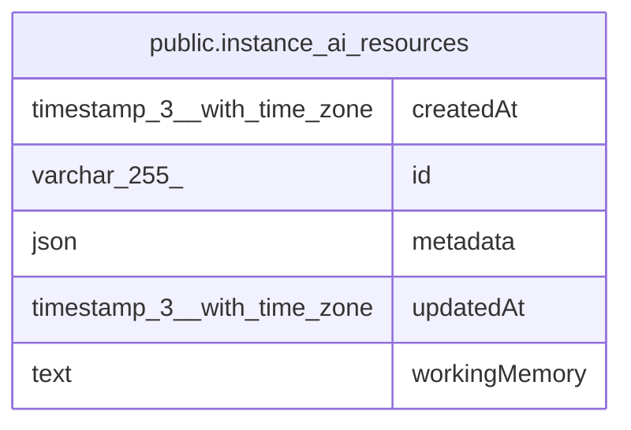

# public.instance_ai_resources

## Columns

| Name | Type | Default | Nullable | Children | Parents | Comment |
| ---- | ---- | ------- | -------- | -------- | ------- | ------- |
| createdAt | timestamp(3) with time zone | CURRENT_TIMESTAMP(3) | false |  |  |  |
| id | varchar(255) |  | false |  |  |  |
| metadata | json |  | true |  |  |  |
| updatedAt | timestamp(3) with time zone | CURRENT_TIMESTAMP(3) | false |  |  |  |
| workingMemory | text |  | true |  |  |  |

## Constraints

| Name | Type | Definition |
| ---- | ---- | ---------- |
| PK_45b5b0b6f715dae4292b86603d8 | PRIMARY KEY | PRIMARY KEY (id) |
| instance_ai_resources_createdAt_not_null | n | NOT NULL "createdAt" |
| instance_ai_resources_id_not_null | n | NOT NULL id |
| instance_ai_resources_updatedAt_not_null | n | NOT NULL "updatedAt" |

## Indexes

| Name | Definition |
| ---- | ---------- |
| PK_45b5b0b6f715dae4292b86603d8 | CREATE UNIQUE INDEX "PK_45b5b0b6f715dae4292b86603d8" ON public.instance_ai_resources USING btree (id) |

## Relations

---

> Generated by [tbls](https://github.com/k1LoW/tbls)
