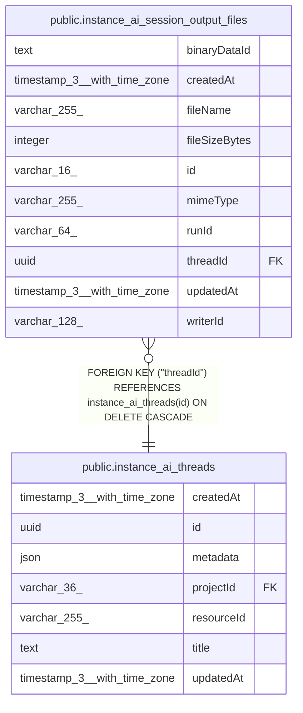

# public.instance_ai_session_output_files

## Columns

| Name | Type | Default | Nullable | Children | Parents | Comment |
| ---- | ---- | ------- | -------- | -------- | ------- | ------- |
| binaryDataId | text |  | false |  |  | Opaque BinaryDataService reference; not an FK to binary_data |
| createdAt | timestamp(3) with time zone | CURRENT_TIMESTAMP(3) | false |  |  |  |
| fileName | varchar(255) |  | false |  |  | Relative posix path from the output dir |
| fileSizeBytes | integer |  | false |  |  |  |
| id | varchar(16) |  | false |  |  | Application-generated n8n nano ID |
| mimeType | varchar(255) |  | false |  |  |  |
| runId | varchar(64) |  | false |  |  | Run that last wrote this file |
| threadId | uuid |  | false |  | [public.instance_ai_threads](public.instance_ai_threads.md) | Session the output file belongs to |
| updatedAt | timestamp(3) with time zone | CURRENT_TIMESTAMP(3) | false |  |  |  |
| writerId | varchar(128) |  | false |  |  | Always parent for Instance AI |

## Constraints

| Name | Type | Definition |
| ---- | ---- | ---------- |
| FK_6ba719e1ba9a0beddf5dde652d9 | FOREIGN KEY | FOREIGN KEY ("threadId") REFERENCES instance_ai_threads(id) ON DELETE CASCADE |
| PK_0af8ba704e06d2f9f10534efdab | PRIMARY KEY | PRIMARY KEY (id) |
| instance_ai_session_output_files_binaryDataId_not_null | n | NOT NULL "binaryDataId" |
| instance_ai_session_output_files_createdAt_not_null | n | NOT NULL "createdAt" |
| instance_ai_session_output_files_fileName_not_null | n | NOT NULL "fileName" |
| instance_ai_session_output_files_fileSizeBytes_not_null | n | NOT NULL "fileSizeBytes" |
| instance_ai_session_output_files_id_not_null | n | NOT NULL id |
| instance_ai_session_output_files_mimeType_not_null | n | NOT NULL "mimeType" |
| instance_ai_session_output_files_runId_not_null | n | NOT NULL "runId" |
| instance_ai_session_output_files_threadId_not_null | n | NOT NULL "threadId" |
| instance_ai_session_output_files_updatedAt_not_null | n | NOT NULL "updatedAt" |
| instance_ai_session_output_files_writerId_not_null | n | NOT NULL "writerId" |

## Indexes

| Name | Definition |
| ---- | ---------- |
| IDX_6ba719e1ba9a0beddf5dde652d | CREATE INDEX "IDX_6ba719e1ba9a0beddf5dde652d" ON public.instance_ai_session_output_files USING btree ("threadId") |
| IDX_ed57c524dbbc4dfed31d062387 | CREATE UNIQUE INDEX "IDX_ed57c524dbbc4dfed31d062387" ON public.instance_ai_session_output_files USING btree ("threadId", "fileName") |
| PK_0af8ba704e06d2f9f10534efdab | CREATE UNIQUE INDEX "PK_0af8ba704e06d2f9f10534efdab" ON public.instance_ai_session_output_files USING btree (id) |

## Relations

---

> Generated by [tbls](https://github.com/k1LoW/tbls)
