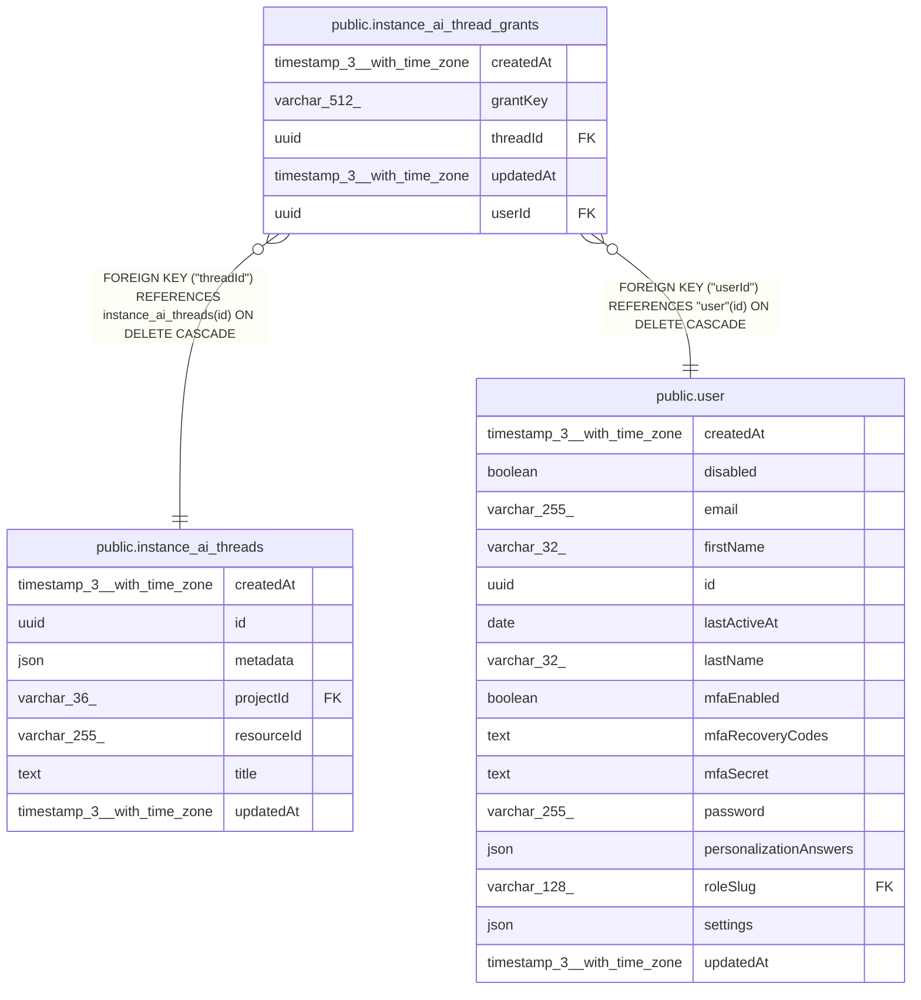

# public.instance_ai_thread_grants

## Columns

| Name | Type | Default | Nullable | Children | Parents | Comment |
| ---- | ---- | ------- | -------- | -------- | ------- | ------- |
| createdAt | timestamp(3) with time zone | CURRENT_TIMESTAMP(3) | false |  |  |  |
| grantKey | varchar(512) |  | false |  |  | Namespaced "always allow" grant the user approved for the thread, e.g. "executions:run:\<workflowId\>". Wide enough to hold a namespace prefix plus a resource identifier. |
| threadId | uuid |  | false |  | [public.instance_ai_threads](public.instance_ai_threads.md) |  |
| updatedAt | timestamp(3) with time zone | CURRENT_TIMESTAMP(3) | false |  |  |  |
| userId | uuid |  | false |  | [public.user](public.user.md) |  |

## Constraints

| Name | Type | Definition |
| ---- | ---- | ---------- |
| FK_401b94abf83d1ac7a841f31330e | FOREIGN KEY | FOREIGN KEY ("userId") REFERENCES "user"(id) ON DELETE CASCADE |
| FK_908202dbc0a9b52f669c11d730c | FOREIGN KEY | FOREIGN KEY ("threadId") REFERENCES instance_ai_threads(id) ON DELETE CASCADE |
| PK_56107d26ebeabf780c5cf311d66 | PRIMARY KEY | PRIMARY KEY ("threadId", "userId", "grantKey") |
| instance_ai_thread_grants_createdAt_not_null | n | NOT NULL "createdAt" |
| instance_ai_thread_grants_grantKey_not_null | n | NOT NULL "grantKey" |
| instance_ai_thread_grants_threadId_not_null | n | NOT NULL "threadId" |
| instance_ai_thread_grants_updatedAt_not_null | n | NOT NULL "updatedAt" |
| instance_ai_thread_grants_userId_not_null | n | NOT NULL "userId" |

## Indexes

| Name | Definition |
| ---- | ---------- |
| IDX_401b94abf83d1ac7a841f31330 | CREATE INDEX "IDX_401b94abf83d1ac7a841f31330" ON public.instance_ai_thread_grants USING btree ("userId") |
| PK_56107d26ebeabf780c5cf311d66 | CREATE UNIQUE INDEX "PK_56107d26ebeabf780c5cf311d66" ON public.instance_ai_thread_grants USING btree ("threadId", "userId", "grantKey") |

## Relations

---

> Generated by [tbls](https://github.com/k1LoW/tbls)
