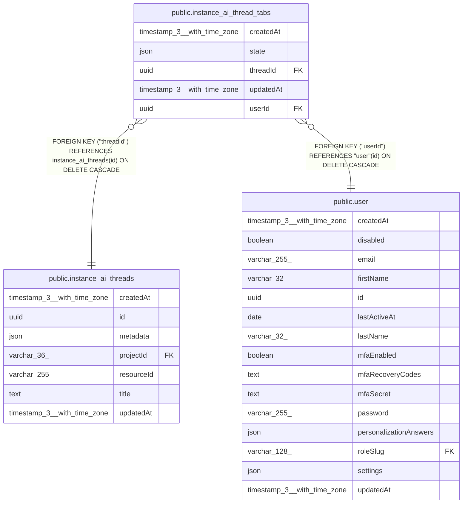

# public.instance_ai_thread_tabs

## Columns

| Name | Type | Default | Nullable | Children | Parents | Comment |
| ---- | ---- | ------- | -------- | -------- | ------- | ------- |
| createdAt | timestamp(3) with time zone | CURRENT_TIMESTAMP(3) | false |  |  |  |
| state | json |  | false |  |  | Tabs the user has open in the thread: { tabs, closedTabs, activeTab }. "tabs" is in display order. "closedTabs" holds closed artifacts so they do not reopen. |
| threadId | uuid |  | false |  | [public.instance_ai_threads](public.instance_ai_threads.md) |  |
| updatedAt | timestamp(3) with time zone | CURRENT_TIMESTAMP(3) | false |  |  |  |
| userId | uuid |  | false |  | [public.user](public.user.md) |  |

## Constraints

| Name | Type | Definition |
| ---- | ---- | ---------- |
| FK_1087a0774e95922e3b5c9af8dd0 | FOREIGN KEY | FOREIGN KEY ("threadId") REFERENCES instance_ai_threads(id) ON DELETE CASCADE |
| FK_4109834dc3cb1c77748ed11e13a | FOREIGN KEY | FOREIGN KEY ("userId") REFERENCES "user"(id) ON DELETE CASCADE |
| PK_61fc902b3494c9b06fbb86a7664 | PRIMARY KEY | PRIMARY KEY ("threadId", "userId") |
| instance_ai_thread_tabs_createdAt_not_null | n | NOT NULL "createdAt" |
| instance_ai_thread_tabs_state_not_null | n | NOT NULL state |
| instance_ai_thread_tabs_threadId_not_null | n | NOT NULL "threadId" |
| instance_ai_thread_tabs_updatedAt_not_null | n | NOT NULL "updatedAt" |
| instance_ai_thread_tabs_userId_not_null | n | NOT NULL "userId" |

## Indexes

| Name | Definition |
| ---- | ---------- |
| IDX_4109834dc3cb1c77748ed11e13 | CREATE INDEX "IDX_4109834dc3cb1c77748ed11e13" ON public.instance_ai_thread_tabs USING btree ("userId") |
| PK_61fc902b3494c9b06fbb86a7664 | CREATE UNIQUE INDEX "PK_61fc902b3494c9b06fbb86a7664" ON public.instance_ai_thread_tabs USING btree ("threadId", "userId") |

## Relations

---

> Generated by [tbls](https://github.com/k1LoW/tbls)
