# public.instance_ai_threads

## Columns

| Name | Type | Default | Nullable | Children | Parents | Comment |
| ---- | ---- | ------- | -------- | -------- | ------- | ------- |
| createdAt | timestamp(3) with time zone | CURRENT_TIMESTAMP(3) | false |  |  |  |
| id | uuid |  | false | [public.ai_builder_temporary_workflow](public.ai_builder_temporary_workflow.md) [public.instance_ai_checkpoints](public.instance_ai_checkpoints.md) [public.instance_ai_events](public.instance_ai_events.md) [public.instance_ai_iteration_logs](public.instance_ai_iteration_logs.md) [public.instance_ai_messages](public.instance_ai_messages.md) [public.instance_ai_observation_cursors](public.instance_ai_observation_cursors.md) [public.instance_ai_observation_locks](public.instance_ai_observation_locks.md) [public.instance_ai_observational_memory](public.instance_ai_observational_memory.md) [public.instance_ai_observations](public.instance_ai_observations.md) [public.instance_ai_pending_confirmations](public.instance_ai_pending_confirmations.md) [public.instance_ai_run_snapshots](public.instance_ai_run_snapshots.md) [public.instance_ai_thread_grants](public.instance_ai_thread_grants.md) |  |  |
| metadata | json |  | true |  |  |  |
| projectId | varchar(36) |  | false |  | [public.project](public.project.md) | Project this thread is scoped to |
| resourceId | varchar(255) |  | false |  |  |  |
| title | text | ''::text | false |  |  |  |
| updatedAt | timestamp(3) with time zone | CURRENT_TIMESTAMP(3) | false |  |  |  |

## Constraints

| Name | Type | Definition |
| ---- | ---- | ---------- |
| FK_instance_ai_threads_projectId | FOREIGN KEY | FOREIGN KEY ("projectId") REFERENCES project(id) ON DELETE CASCADE |
| PK_35575100e45cdedeb89ae0643e9 | PRIMARY KEY | PRIMARY KEY (id) |
| instance_ai_threads_createdAt_not_null | n | NOT NULL "createdAt" |
| instance_ai_threads_id_not_null | n | NOT NULL id |
| instance_ai_threads_projectId_not_null | n | NOT NULL "projectId" |
| instance_ai_threads_resourceId_not_null | n | NOT NULL "resourceId" |
| instance_ai_threads_title_not_null | n | NOT NULL title |
| instance_ai_threads_updatedAt_not_null | n | NOT NULL "updatedAt" |

## Indexes

| Name | Definition |
| ---- | ---------- |
| IDX_f36dea4d38fe92e0e8f44d5a56 | CREATE INDEX "IDX_f36dea4d38fe92e0e8f44d5a56" ON public.instance_ai_threads USING btree ("resourceId") |
| IDX_instance_ai_threads_projectId | CREATE INDEX "IDX_instance_ai_threads_projectId" ON public.instance_ai_threads USING btree ("projectId") |
| PK_35575100e45cdedeb89ae0643e9 | CREATE UNIQUE INDEX "PK_35575100e45cdedeb89ae0643e9" ON public.instance_ai_threads USING btree (id) |

## Relations

```mermaid
erDiagram

"public.ai_builder_temporary_workflow" }o--|| "public.instance_ai_threads" : "FOREIGN KEY (#quot;threadId#quot;) REFERENCES instance_ai_threads(id) ON DELETE CASCADE"
"public.instance_ai_checkpoints" }o--|| "public.instance_ai_threads" : "FOREIGN KEY (#quot;threadId#quot;) REFERENCES instance_ai_threads(id) ON DELETE CASCADE"
"public.instance_ai_events" }o--|| "public.instance_ai_threads" : "FOREIGN KEY (#quot;threadId#quot;) REFERENCES instance_ai_threads(id) ON DELETE CASCADE"
"public.instance_ai_iteration_logs" }o--|| "public.instance_ai_threads" : "FOREIGN KEY (#quot;threadId#quot;) REFERENCES instance_ai_threads(id) ON DELETE CASCADE"
"public.instance_ai_messages" }o--|| "public.instance_ai_threads" : "FOREIGN KEY (#quot;threadId#quot;) REFERENCES instance_ai_threads(id) ON DELETE CASCADE"
"public.instance_ai_observation_cursors" |o--|| "public.instance_ai_threads" : "FOREIGN KEY (#quot;observationScopeId#quot;) REFERENCES instance_ai_threads(id) ON DELETE CASCADE"
"public.instance_ai_observation_locks" }o--|| "public.instance_ai_threads" : "FOREIGN KEY (#quot;observationScopeId#quot;) REFERENCES instance_ai_threads(id) ON DELETE CASCADE"
"public.instance_ai_observational_memory" }o--o| "public.instance_ai_threads" : "FOREIGN KEY (#quot;threadId#quot;) REFERENCES instance_ai_threads(id) ON DELETE SET NULL"
"public.instance_ai_observations" }o--|| "public.instance_ai_threads" : "FOREIGN KEY (#quot;observationScopeId#quot;) REFERENCES instance_ai_threads(id) ON DELETE CASCADE"
"public.instance_ai_pending_confirmations" }o--|| "public.instance_ai_threads" : "FOREIGN KEY (#quot;threadId#quot;) REFERENCES instance_ai_threads(id) ON DELETE CASCADE"
"public.instance_ai_run_snapshots" }o--|| "public.instance_ai_threads" : "FOREIGN KEY (#quot;threadId#quot;) REFERENCES instance_ai_threads(id) ON DELETE CASCADE"
"public.instance_ai_thread_grants" }o--|| "public.instance_ai_threads" : "FOREIGN KEY (#quot;threadId#quot;) REFERENCES instance_ai_threads(id) ON DELETE CASCADE"
"public.instance_ai_threads" }o--|| "public.project" : "FOREIGN KEY (#quot;projectId#quot;) REFERENCES project(id) ON DELETE CASCADE"

"public.instance_ai_threads" {
  timestamp_3__with_time_zone createdAt
  uuid id
  json metadata
  varchar_36_ projectId FK
  varchar_255_ resourceId
  text title
  timestamp_3__with_time_zone updatedAt
}
"public.ai_builder_temporary_workflow" {
  timestamp_3__with_time_zone createdAt
  uuid threadId FK
  timestamp_3__with_time_zone updatedAt
  varchar_36_ workflowId FK
}
"public.instance_ai_checkpoints" {
  timestamp_3__with_time_zone createdAt
  timestamp_3__with_time_zone expiredAt
  varchar_255_ key
  varchar_255_ resourceId
  varchar_255_ runId
  json state
  uuid threadId FK
  timestamp_3__with_time_zone updatedAt
}
"public.instance_ai_events" {
  timestamp_3__with_time_zone createdAt
  text payload
  varchar_64_ runId
  integer seq
  uuid threadId FK
  varchar_64_ type
  timestamp_3__with_time_zone updatedAt
}
"public.instance_ai_iteration_logs" {
  timestamp_3__with_time_zone createdAt
  text entry
  varchar_36_ id
  varchar taskKey
  uuid threadId FK
  timestamp_3__with_time_zone updatedAt
}
"public.instance_ai_messages" {
  text content
  timestamp_3__with_time_zone createdAt
  varchar_36_ id
  varchar_255_ resourceId
  varchar_16_ role
  uuid threadId FK
  varchar_32_ type
  timestamp_3__with_time_zone updatedAt
}
"public.instance_ai_observation_cursors" {
  timestamp_3__with_time_zone createdAt
  timestamp_3__with_time_zone lastObservedAt
  varchar_36_ lastObservedMessageId
  uuid observationScopeId FK
  timestamp_3__with_time_zone updatedAt
}
"public.instance_ai_observation_locks" {
  timestamp_3__with_time_zone createdAt
  timestamp_3__with_time_zone heldUntil
  varchar_64_ holderId
  uuid observationScopeId FK
  varchar_20_ taskKind
  timestamp_3__with_time_zone updatedAt
}
"public.instance_ai_observational_memory" {
  text activeObservations
  json bufferedMessageIds
  json bufferedObservationChunks
  integer bufferedObservationTokens
  text bufferedObservations
  text bufferedReflection
  integer bufferedReflectionInputTokens
  integer bufferedReflectionTokens
  text config
  timestamp_3__with_time_zone createdAt
  integer generationCount
  varchar_36_ id
  boolean isBufferingObservation
  boolean isBufferingReflection
  boolean isObserving
  boolean isReflecting
  timestamp_3__with_time_zone lastBufferedAtTime
  integer lastBufferedAtTokens
  timestamp_3__with_time_zone lastObservedAt
  varchar_255_ lookupKey
  json metadata
  integer observationTokenCount
  json observedMessageIds
  varchar observedTimezone
  varchar_32_ originType
  integer pendingMessageTokens
  integer reflectedObservationLineCount
  varchar_255_ resourceId
  varchar_16_ scope
  uuid threadId FK
  integer totalTokensObserved
  timestamp_3__with_time_zone updatedAt
}
"public.instance_ai_observations" {
  timestamp_3__with_time_zone createdAt
  varchar_36_ id
  varchar_16_ marker
  uuid observationScopeId FK
  varchar_36_ parentId FK
  varchar_16_ status
  varchar_36_ supersededBy FK
  text text
  integer tokenCount
  timestamp_3__with_time_zone updatedAt
}
"public.instance_ai_pending_confirmations" {
  varchar_255_ checkpointKey FK
  varchar_36_ checkpointTaskId
  timestamp_3__with_time_zone createdAt
  timestamp_3__with_time_zone expiresAt
  varchar_16_ kind
  varchar_36_ messageGroupId
  varchar_36_ requestId
  varchar_36_ runId
  uuid threadId FK
  varchar_64_ toolCallId
  timestamp_3__with_time_zone updatedAt
  uuid userId FK
}
"public.instance_ai_run_snapshots" {
  timestamp_3__with_time_zone createdAt
  varchar_36_ langsmithRunId
  varchar_36_ langsmithTraceId
  varchar_36_ messageGroupId
  varchar_36_ runId
  json runIds
  varchar_64_ spanId
  uuid threadId FK
  varchar_64_ traceId
  text tree
  timestamp_3__with_time_zone updatedAt
}
"public.instance_ai_thread_grants" {
  timestamp_3__with_time_zone createdAt
  varchar_512_ grantKey
  uuid threadId FK
  timestamp_3__with_time_zone updatedAt
  uuid userId FK
}
"public.project" {
  timestamp_3__with_time_zone createdAt
  uuid creatorId FK
  json customTelemetryTags
  varchar_512_ description
  json icon
  varchar_36_ id
  varchar_255_ name
  varchar_36_ type
  timestamp_3__with_time_zone updatedAt
}
```

---

> Generated by [tbls](https://github.com/k1LoW/tbls)
