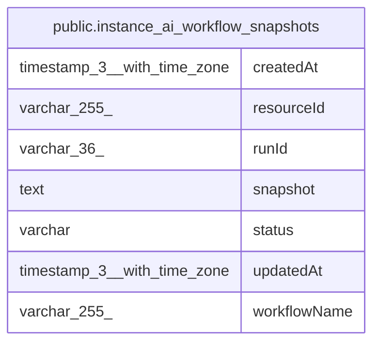

# public.instance_ai_workflow_snapshots

## Columns

| Name | Type | Default | Nullable | Children | Parents | Comment |
| ---- | ---- | ------- | -------- | -------- | ------- | ------- |
| createdAt | timestamp(3) with time zone | CURRENT_TIMESTAMP(3) | false |  |  |  |
| resourceId | varchar(255) |  | true |  |  |  |
| runId | varchar(36) |  | false |  |  |  |
| snapshot | text |  | false |  |  |  |
| status | varchar |  | true |  |  |  |
| updatedAt | timestamp(3) with time zone | CURRENT_TIMESTAMP(3) | false |  |  |  |
| workflowName | varchar(255) |  | false |  |  |  |

## Constraints

| Name | Type | Definition |
| ---- | ---- | ---------- |
| PK_93f2696eb321dfe1d7defe7073f | PRIMARY KEY | PRIMARY KEY ("runId", "workflowName") |
| instance_ai_workflow_snapshots_createdAt_not_null | n | NOT NULL "createdAt" |
| instance_ai_workflow_snapshots_runId_not_null | n | NOT NULL "runId" |
| instance_ai_workflow_snapshots_snapshot_not_null | n | NOT NULL snapshot |
| instance_ai_workflow_snapshots_updatedAt_not_null | n | NOT NULL "updatedAt" |
| instance_ai_workflow_snapshots_workflowName_not_null | n | NOT NULL "workflowName" |

## Indexes

| Name | Definition |
| ---- | ---------- |
| IDX_a371ee6b8e0ebb5635f8baa46d | CREATE INDEX "IDX_a371ee6b8e0ebb5635f8baa46d" ON public.instance_ai_workflow_snapshots USING btree ("workflowName", status) |
| PK_93f2696eb321dfe1d7defe7073f | CREATE UNIQUE INDEX "PK_93f2696eb321dfe1d7defe7073f" ON public.instance_ai_workflow_snapshots USING btree ("runId", "workflowName") |

## Relations

---

> Generated by [tbls](https://github.com/k1LoW/tbls)
