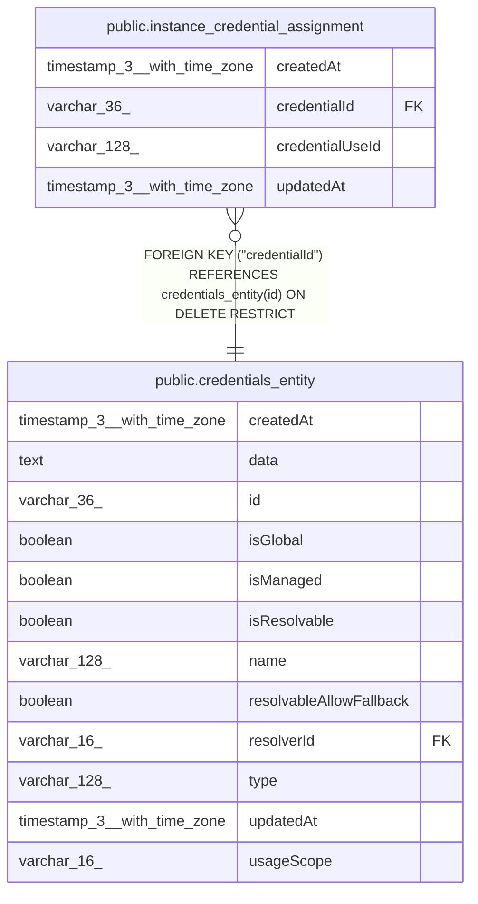

# public.instance_credential_assignment

## Columns

| Name | Type | Default | Nullable | Children | Parents | Comment |
| ---- | ---- | ------- | -------- | -------- | ------- | ------- |
| createdAt | timestamp(3) with time zone | CURRENT_TIMESTAMP(3) | false |  |  |  |
| credentialId | varchar(36) |  | false |  | [public.credentials_entity](public.credentials_entity.md) | Credential assigned to the registered use; repositories enforce instance usage scope |
| credentialUseId | varchar(128) |  | false |  |  | Stable credential use registered with the instance credential broker |
| updatedAt | timestamp(3) with time zone | CURRENT_TIMESTAMP(3) | false |  |  |  |

## Constraints

| Name | Type | Definition |
| ---- | ---- | ---------- |
| FK_instance_credential_assignment_credential | FOREIGN KEY | FOREIGN KEY ("credentialId") REFERENCES credentials_entity(id) ON DELETE RESTRICT |
| PK_984b0a98726485c9a330cde6b2f | PRIMARY KEY | PRIMARY KEY ("credentialUseId") |
| instance_credential_assignment_createdAt_not_null | n | NOT NULL "createdAt" |
| instance_credential_assignment_credentialId_not_null | n | NOT NULL "credentialId" |
| instance_credential_assignment_credentialUseId_not_null | n | NOT NULL "credentialUseId" |
| instance_credential_assignment_updatedAt_not_null | n | NOT NULL "updatedAt" |

## Indexes

| Name | Definition |
| ---- | ---------- |
| IDX_9626b8dc1bee96a86a3ee09d73 | CREATE INDEX "IDX_9626b8dc1bee96a86a3ee09d73" ON public.instance_credential_assignment USING btree ("credentialId") |
| PK_984b0a98726485c9a330cde6b2f | CREATE UNIQUE INDEX "PK_984b0a98726485c9a330cde6b2f" ON public.instance_credential_assignment USING btree ("credentialUseId") |

## Relations

---

> Generated by [tbls](https://github.com/k1LoW/tbls)
