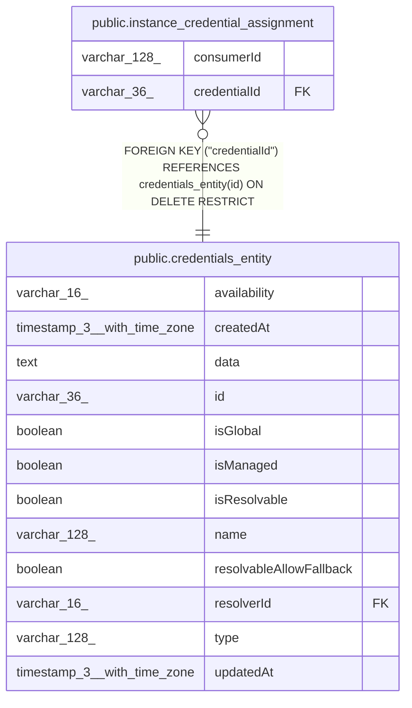

# public.instance_credential_assignment

## Columns

| Name | Type | Default | Nullable | Children | Parents | Comment |
| ---- | ---- | ------- | -------- | -------- | ------- | ------- |
| consumerId | varchar(128) |  | false |  |  | Stable server-side feature use registered with the credential broker |
| credentialId | varchar(36) |  | false |  | [public.credentials_entity](public.credentials_entity.md) |  |

## Constraints

| Name | Type | Definition |
| ---- | ---- | ---------- |
| FK_instance_credential_assignment_credential | FOREIGN KEY | FOREIGN KEY ("credentialId") REFERENCES credentials_entity(id) ON DELETE RESTRICT |
| PK_3d4cbf3bcfe7577d2160c030cdd | PRIMARY KEY | PRIMARY KEY ("consumerId") |
| instance_credential_assignment_consumerId_not_null | n | NOT NULL "consumerId" |
| instance_credential_assignment_credentialId_not_null | n | NOT NULL "credentialId" |

## Indexes

| Name | Definition |
| ---- | ---------- |
| IDX_9626b8dc1bee96a86a3ee09d73 | CREATE INDEX "IDX_9626b8dc1bee96a86a3ee09d73" ON public.instance_credential_assignment USING btree ("credentialId") |
| PK_3d4cbf3bcfe7577d2160c030cdd | CREATE UNIQUE INDEX "PK_3d4cbf3bcfe7577d2160c030cdd" ON public.instance_credential_assignment USING btree ("consumerId") |

## Relations

---

> Generated by [tbls](https://github.com/k1LoW/tbls)
